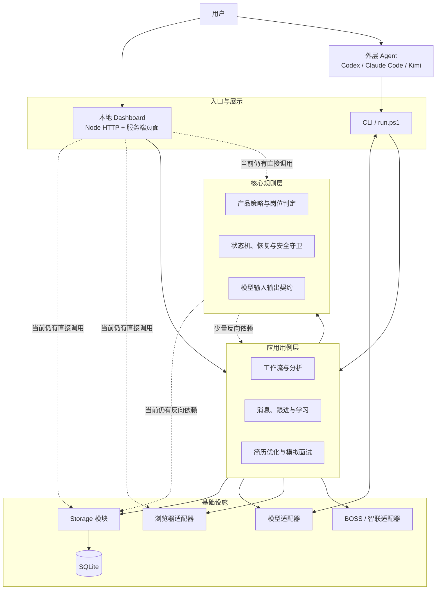

# OfferGo 当前架构与架构审查

更新日期：2026-09-16  
审查提交：`8f2dfc563c26405ed65e9d794053c92c4a8ecc5b`  
适用范围：当前源码、桌面工作台、无界面 Agent 路径、本地数据库、招聘平台适配器、测试与发布链路

## 1. 先说结论

OfferGo 当前采用的是**本地模块化单体**：程序作为一个完整应用交付，但内部按页面、业务用例、业务规则、数据存储和外部平台接入分成模块。这个选择适合当前产品，不需要改成微服务。

整体架构可以继续演进，当前没有发现必须停下功能开发、立即推倒重写的结构性故障。它的主要风险是**模块边界只完成了一半**：目录已经分层，但 Dashboard、CLI、`core` 和 `storage` 仍存在较多跨层调用。随着功能增加，几个入口文件重新变大，修改冲突和回归风险正在累积。

当前判断：

| 方面 | 判断 | 说明 |
|---|---|---|
| 产品形态选择 | 健康 | 单用户、本地运行、SQLite，模块化单体比微服务更合适 |
| 安全与恢复 | 较强 | 有访问额度、租约、心跳、检查点、身份核验、失败即停和数据库迁移备份 |
| 外部能力隔离 | 较强 | 模型、浏览器和招聘平台已有适配器，Agent 也复用统一模型契约 |
| 模块边界 | 中等偏弱 | 分层存在，但跨层调用和直接 SQL 仍较多 |
| 长期维护成本 | 黄灯 | `server.js`、`cli.js`、`boss.js`、`storage.js` 再次成为集中修改点 |
| 测试保障 | 强，但反馈偏重 | 离线检查覆盖广，但全部检查串行运行，快速反馈层不足 |
| 文档治理 | 中等偏弱 | 有当前文档导航，但历史计划、规格和证据数量很大，容易淹没当前真相 |

## 2. 给初学者的整体解释

可以把 OfferGo 想成一栋只服务一个用户的办公楼：

- **Dashboard 和 CLI** 是前台。Dashboard 接待人在网页上的操作，CLI 接待终端或 Agent 的命令。
- **Application** 是项目经理。它负责安排“先做什么、后做什么”，例如开始一轮找岗、继续中断任务、生成回复草稿。
- **Core** 是业务规则手册。它定义岗位怎么评分、哪些状态能互相转换、什么时候必须停、什么算风险。
- **Storage** 是档案室。它把画像、岗位、扫描、工作流、消息和历史记录保存在 SQLite 数据库里。
- **Adapters** 是翻译和外勤人员。它们负责和大模型、Edge、BOSS、智联这些外部系统沟通。
- **Reports 和安装脚本** 负责把结果导出，并把程序打包成用户能运行的版本。

现在的问题不是“没有部门”，而是一些前台和规则人员仍会直接去档案室查表，或者直接联系外勤人员。人少时还能工作，功能继续增加后，同一次修改就容易牵动很多地方。

## 3. 当前架构图



实线表示目标主路径，虚线表示当前仍需逐步收口的跨层调用。

## 4. 两条用户路径如何共用同一套能力

### 4.1 普通用户路径

1. 用户启动本地 Dashboard。
2. 在页面中配置模型 Key、上传简历、确认画像和搜索方案。
3. Dashboard 调用应用用例，创建工作流。
4. 扫描任务以独立 CLI 子进程运行，避免长任务绑死页面请求。
5. 浏览器和平台适配器只读获取岗位，模型适配器完成结构化分析。
6. 结果写入本地 SQLite，再由 Dashboard 展示。
7. 任何真实沟通都经过不可变批次确认，并串行执行。

### 4.2 Agent 无界面路径

1. 外层 Agent 直接运行 `agent-onboard` 等 CLI 命令，不启动 Dashboard。
2. OfferGo 通过标准输入和标准输出发送一行一条的 JSON 请求。
3. 外层 Agent 返回结构化结果，OfferGo 继续使用现有模型契约校验。
4. 相同 `operation-id` 表示同一次命令重试；新的使用轮次采用新的 ID。
5. 简历内容没有变化时复用画像、匹配卡和搜索方案；只有明确要求刷新才重新生成。
6. 后续扫描建立新轮次，但继续复用同一候选人基础资料。

这两条路径共享业务规则、模型契约和数据库。差别只在“模型由 API 提供，还是由当前外层 Agent 提供”。这是合理的融合方式，不需要为每一种 Agent 建独立适配器。

## 5. 运行与数据设计

### 5.1 进程模型

Dashboard 是本地 HTTP 服务。扫描等长任务由 Dashboard 启动 CLI 子进程执行。扫描使用站点租约和定时心跳：同一站点同一时间只允许一个受控扫描拥有执行权；租约丢失会终止任务。

这比把所有工作都塞在一次网页请求里稳健，也比引入消息队列简单，适合当前单机规模。

### 5.2 数据库

系统使用 Node 22 自带的 SQLite 接口，打开数据库时启用：

- `busy_timeout = 5000`：短暂写锁冲突时等待，而不是立即失败。
- WAL：读写并发更友好。
- 外键检查：减少孤立数据。
- 迁移前后完整性检查。
- 升级已有数据库前自动备份。
- 多步骤关键写入使用 `BEGIN IMMEDIATE` 事务，失败时整体回滚。

当前 schema 约有 52 张业务表。数量本身不是错误，因为系统同时保存画像、简历版本、岗位事实、岗位观察、扫描、工作流、沟通、消息、漏斗、简历优化和面试记录。真正需要管理的是：每组表由谁负责、跨表修改由哪个用例开启事务、状态之间如何保持一致。

### 5.3 外部平台安全

平台访问保留了严格的产品边界：只读扫描、固定标签页身份、串行操作、随机节奏、访问额度、检查点、登录和风控即停。真实沟通需要用户对当前不可变批次明确授权，结果不明确时不能自动重试。

这些不是多余复杂度，而是产品正确性的一部分，不能在架构简化时删除。

## 6. 代码规模与依赖证据

本次静态审查得到以下当前数据：

| 指标 | 当前值 |
|---|---:|
| JavaScript 源码文件 | 158 |
| JavaScript 源码行数 | 约 63,087 |
| 测试脚本 | 167 个文件，其中完整门禁注册 165 项 |
| 测试代码行数 | 约 94,402 |
| 运行依赖 | 1 个：`pdfjs-dist` |
| 源码文件级循环引用 | 0 |
| 数据库业务表 | 约 52 |

最集中的文件：

| 文件 | 行数 | 观察 |
|---|---:|---|
| `src/dashboard/server.js` | 7,112 | 约 265 个函数、82 个精确路由分支、82 个内部模块依赖 |
| `src/adapters/sites/boss.js` | 3,569 | BOSS 列表、详情、页面判断和操作能力仍较集中 |
| `src/cli.js` | 3,174 | 命令解析、依赖组装、扫描、分析、沟通和 Agent 首次使用集中 |
| `src/core/storage.js` | 2,644 | 数据库打开、schema、迁移、兼容门面和部分存取逻辑集中 |
| `src/core/model_contract.js` | 1,849 | 多种模型任务契约集中 |

数据库调用分布也说明边界还未收口：发现约 567 处 `db.prepare` 调用，其中 384 处位于 `storage`，143 处仍位于 `core`，23 处位于 `dashboard`，17 处位于 `application`。

依赖图没有文件级循环，这是重要优点。但按目录汇总后，`core -> storage` 与 `storage -> core` 同时存在；Dashboard 也同时依赖 application、core、storage 和 adapters。也就是说，代码能正常加载，但架构层之间形成了概念上的双向依赖。

## 7. 做得好的地方

### 7.1 技术选择克制

项目没有为了“看起来先进”引入 SPA 框架、ORM、消息队列、容器编排或微服务。运行依赖只有一个 PDF 解析库。对本地单用户产品，这是明显优势：安装更简单、故障面更小、数据不必离开本机。

### 7.2 恢复语义比普通原型成熟

工作流、扫描、岗位分析和沟通都有持久状态；长任务有租约、心跳、检查点和中断恢复；数据库迁移有备份和完整性检查。这使它已经不是“一关程序就全丢”的演示项目。

### 7.3 外部系统通过适配器接入

模型提供方、Agent stdio、浏览器传输、BOSS 和智联都已有明确适配器。模型结果还要经过统一结构化契约校验，外部返回不能直接污染内部状态。

### 7.4 测试广度高

测试覆盖安装、启动、数据库迁移、浏览器身份、扫描恢复、工作流、沟通、消息、智联、模型、简历和 Agent 路径。当前提交此前已通过 165 项完整离线门禁。静态依赖检查还确认当前没有源码文件级循环引用。

## 8. 主要问题与建议

### P1：Dashboard 入口承担过多职责

**现状：** `server.js` 同时负责 HTTP 路由、表单解析、页面状态、依赖组装、部分业务编排、浏览器检查和少量直接 SQL。

**风险：** 新增一个页面功能时，容易碰到同一个文件；路由、业务规则和基础设施变化互相干扰；评审很难只看一个清晰边界。

**建议：** 按产品用例迁移路由，例如 `routes/workflow.js`、`routes/messages.js`、`routes/profile.js`。路由只做输入转换、调用 application 用例、返回页面或 JSON。不要把 7,112 行机械切成多个同样混杂的文件。

### P1：CLI 同时是入口、装配器和业务执行器

**现状：** `cli.js` 有 20 多个命令分支，既解析参数，也创建浏览器/模型/站点依赖，还直接执行扫描、沟通和 Agent 首次使用。

**风险：** 无界面 Agent 能力继续增加后，CLI 会成为第二个 `server.js`；同一用例可能在网页和 CLI 各写一套编排。

**建议：** 建立薄命令处理器，例如 `src/commands/agent_onboard.js`、`scan.js`、`communicate.js`。Dashboard 和 CLI 都调用同一个 application 用例。保留一个简单的运行上下文装配函数即可，不需要引入依赖注入框架。

### P1：依赖方向没有自动守门

**现状：** `core` 会调用 storage、adapter，甚至有一处调用 application；storage 又会调用 core。Dashboard 直接依赖多个底层模块。

**风险：** 目录名字会逐渐失去意义。开发者无法只看一层就理解影响范围，测试也更难隔离。

**建议：** 明确并自动检查以下方向：

```text
入口（Dashboard / CLI） -> Application -> Core
Application -> Storage 端口 / 模型端口 / 浏览器端口 / 平台端口
Adapters 和 Storage -> 实现端口，并可使用 Core 的纯数据类型和纯函数
Core -> 不依赖 Dashboard、Application、Adapters 或具体 Storage
```

先新增一个几秒内完成的依赖边界检查。以后每迁移一个功能，就删除对应例外；不要一次性搬完所有文件。

### P1：数据库所有权仍然分散

**现状：** 大部分 SQL 已进入 storage，但 core、application 和 dashboard 仍有直接查询。`core/storage.js` 同时负责 schema、迁移、数据库打开、兼容导出和部分业务查询，并导出大量操作。

**风险：** 跨表事务边界不容易看清；schema 修改容易影响业务层；同一种查询可能在多个页面重复实现。

**建议：**

1. 保留 SQLite 和原生 SQL，不引入 ORM。
2. 把 schema、迁移和数据库连接拆为独立文件，但仍由一个 `openDb` 入口管理。
3. 页面层不再新增直接 SQL；现有 SQL 随相关功能改动迁移到对应 store 或只读查询服务。
4. 跨多个 store 的写操作由 application 用例拥有一个事务，不能拆成多个各自提交的小操作。
5. `core/storage.js` 暂时保留兼容门面，但只减不增。

### P1：多个状态系统缺少一张统一生命周期地图

**现状：** 系统同时有 onboarding run、scan run、batch、workflow run、workflow job task、communication batch、message send batch 和 funnel round。每一套状态都有合理来源，但它们之间存在联动。

**风险：** 某个子状态已结束，父状态仍显示运行中；恢复逻辑容易遗漏一种组合；用户看到的“正在运行、可继续、需复核”可能和底层记录不一致。

**建议：** 建立一张权威生命周期表，写明：

- 每种运行记录的唯一负责人。
- 合法状态转换。
- 父子状态如何汇总。
- 进程退出、超时、用户暂停和风控分别落到什么状态。
- 哪些转换必须在同一个数据库事务里完成。

随后为每个状态机保留一个转换入口和一组不变量检查，不需要把所有状态合成一张万能表。

### P2：BOSS 适配器仍然过大

**现状：** `boss.js` 超过 3,500 行，虽然消息读取和发送已经拆出，但搜索列表、详情读取、身份判断和页面操作仍较集中。

**风险：** 网站页面结构变化时，修一个选择器可能影响扫描的其他阶段；真实平台相关代码的评审范围过大。

**建议：** 只在有真实 DOM 证据、且正在改对应功能时，逐步拆成页面身份、列表读取、详情读取、搜索条件和只读动作模块。保持现有串行、节奏、额度和失败即停语义，不做一次性重写。

### P2：完整测试很强，但缺少快速反馈层

**现状：** 完整门禁注册 165 项脚本，逐个启动 Node 进程并串行执行。覆盖很广，但开发者修改一个纯规则函数时也要面对较重的完整验证。

**风险：** 反馈慢会诱使人只跑少量测试，直到最后才发现跨模块问题。

**建议：** 保留 `npm test` 作为发布前完整门禁，增加：

- `test:fast`：纯函数、契约、状态转换、依赖边界。
- `test:integration`：SQLite、应用用例、CLI 和 Dashboard。
- `test:package`：安装、启动、便携运行和发布包。

CI 可以在互不共享本地资源的前提下并行 fast 和 integration，最后仍保留一次完整串行门禁。

### P2：当前文档被历史资料包围

**现状：** `docs` 下约 558 个文件，其中 `superpowers/plans` 157 个、`superpowers/specs` 132 个。`docs/README.md` 已说明历史文件不代表当前状态，这是正确方向，但当前交接文件仍很长，寻找最新结论成本较高。

**风险：** 新开发者或 Agent 可能引用旧计划中的数字、状态或边界，误当成当前事实。

**建议：** 当前真源只保留一个短导航、一份当前架构、一份产品规格和一份当前交接。历史计划和证据继续保留，但统一放入明确的 archive 索引；大批可再生成截图和运行证据优先放在仓库外验收目录，只在仓库中保存摘要和哈希。

### P3：旧名称仍存在于运行兼容层

**现状：** 产品已更名为 OfferGo，但数据目录、部分错误码、CSS 文件名和安装兼容逻辑仍使用 RoleFlow。

**风险：** 主要是认知和维护成本，不是当前功能故障。直接全局替换反而可能破坏旧用户升级。

**建议：** 把旧名称明确标记为兼容常量；新代码统一使用 OfferGo。等安装升级迁移方案成熟后，再决定是否迁移数据目录，不做全仓机械替换。

## 9. 推荐实施顺序

### 第一阶段：先建立护栏，不改业务行为

1. 把本文作为当前架构真源，并加入文档导航。
2. 增加依赖方向检查和例外清单。
3. 增加 `test:fast`，把纯规则和架构检查放进去。
4. 建立统一生命周期地图。

成功信号：新增功能不能继续扩大跨层依赖；开发者能在几分钟内得到第一轮反馈。

### 第二阶段：收口两个入口

1. 新 CLI 功能必须进入独立命令处理器。
2. 新 Dashboard 路由必须调用 application 用例。
3. 修改旧功能时顺手迁移对应路由和命令，不做全量重写。
4. 页面和 CLI 对同一用例使用相同输入对象与结果对象。

成功信号：`server.js` 和 `cli.js` 不再随着每个功能线性增长，网页与 Agent 路径不再复制业务流程。

### 第三阶段：整理存储和状态所有权

1. schema、迁移、连接管理与业务 store 分开。
2. 逐步清除 Dashboard 的直接 SQL。
3. 把跨表写入收口到 application 事务。
4. 用状态不变量测试覆盖恢复、重复请求和进程异常退出。

成功信号：看到一条状态或一张表，就能明确找到唯一负责人；恢复路径不需要在多个层重复修补。

### 第四阶段：按真实变化拆平台适配器

只在 BOSS 或智联实际发生页面变化、并有只读证据时拆对应模块。每次拆分都保留真实 fixture、身份核验、访问额度和失败即停回归。

## 10. 明确不建议做的事

- 不改成微服务。当前没有独立扩容、多人团队边界或远程部署需求，拆服务只会增加通信、部署和一致性问题。
- 不引入 ORM。现有 SQL 需要精确事务、迁移和查询控制，原生 SQLite 足够。
- 不为了减行数引入大型前端框架。服务端页面和少量原生 JavaScript 仍适合当前产品。
- 不建立通用事件总线或消息队列。当前的子进程、SQLite、租约和检查点已经能解决单机长任务问题。
- 不进行一次性全仓 TypeScript 改写。若以后需要类型保护，可以先从模型契约、应用输入输出和状态枚举增加 JSDoc 或小范围类型检查。
- 不把所有状态合并成一个“万能工作流”。各业务记录有不同生命周期，应统一规则和观测，而不是强行共用一张表。

## 11. 最终架构目标

OfferGo 不需要变成更大的系统，而要变成边界更清楚的系统：

```text
两个薄入口（Dashboard / CLI）
        -> 一套共享应用用例
        -> 一套纯业务规则和状态机
        -> 明确的存储、模型、浏览器和平台端口
        -> 本地 SQLite 与外部适配器
```

最终衡量标准不是目录数量或文件行数，而是：同一个业务流程只有一套编排；外部平台变化不会扩散到核心规则；数据库状态有唯一负责人；重复执行、中断和恢复都有确定结果；普通用户和 Agent 使用的是同一个产品内核。
