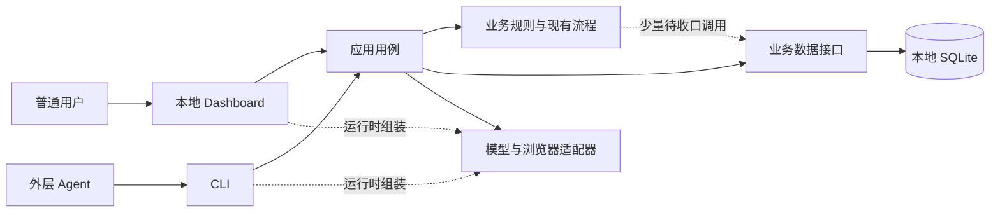

# OfferGo 当前架构

核对日期：2026-10-10，正式发布基线仍为 v1.4.1；当前源码正在实施岗位筛选统一决策改造。本文描述当前源码；后续改动应同步更新相关段落。2026-09-16 的[早期架构审查](superpowers/reports/2026-09-16-architecture-review.md)保留当时的判断和数字，不代表当前状态。

## 先看整体

OfferGo 是运行在用户电脑上的**模块化单体**：Dashboard、无界面 CLI、业务逻辑和 SQLite 数据库属于同一个产品，不需要部署多台服务。普通用户从页面操作；把项目交给 Agent 的用户由外层 Agent 运行 CLI，不必打开 Dashboard，也不在设置页填写 Agent 的 Key。

```mermaid
flowchart LR
  U[普通用户] --> D[本地 Dashboard]
  A[外层 Agent] --> C[CLI]
  D --> AP[应用用例]
  C --> AP
  AP --> CO[业务规则与现有流程]
  AP --> ST[业务数据接口]
  ST --> DB[(本地 SQLite)]
  D -.运行时组装.-> AD[模型与浏览器适配器]
  C -.运行时组装.-> AD
  AP --> AD
  CO -.少量待收口调用.-> ST
```

这张图只表达主要职责。虚线说明当前确实存在的过渡调用；它不表示每条虚线都是故障。`src/cli.js` 和 `src/dashboard/server.js` 可以负责创建数据库、模型与浏览器实例，再把它们交给实际执行任务的模块。

## 每一层做什么

| 位置 | 用普通话理解 | 主要职责 |
|---|---|---|
| `src/dashboard/` | 网页入口 | 读用户输入、展示结果、管理页面请求及当前浏览器运行状态 |
| `src/cli.js`、`src/commands/` | Agent 和终端入口 | 解析命令、建立运行环境、输出约定格式；复杂业务应交给应用用例 |
| `src/application/` | 办事流程 | 决定一项任务的步骤、校验前置条件、调用规则和明确的数据接口 |
| `src/core/` | 规则和部分历史流程 | 岗位判定、消息规则、模型契约等；少数较早写入的流程仍混有数据或平台调用 |
| `src/storage/` | 数据档案室 | SQLite 查询、写入、迁移和事务相关操作 |
| `src/adapters/` | 对外接口 | 模型、浏览器、BOSS 和智联的具体访问 |

一条找岗流程通常由页面或 CLI 发起，应用用例协调扫描与分析，适配器读取平台，存储模块保存结果，再由页面或 CLI 呈现。对真实平台的写入还要经过用户对具体批次的授权，不能因为架构调整而跳过。

## 数据和运行方式

岗位分析由 `createJobAnalysisRunner` 调用现有模型适配器理解 JD、选择工作方向、核对要求。三个纯规则模块分别负责：`job_match_evidence` 整理事实来源，`job_match_conditions` 区分必须满足的资格、工作能力与加分项，`job_match_decision` 生成唯一的正式推荐。学历或证照满足不再增加能力分；明确资格不符优先排除，资料未知保留待确认，原能力矩阵和 70/30 权重保持。

结构化结果仍保存在原有 `analysis_json`，没有新增数据库表或版本迁移。岗位清单、默认选择、消息上下文、分析队列、恢复进度与关键词统计检查同一管线版本；旧分析和草稿保留用于历史查看，但需重新分析后才能作为当前结果。已有完整本地 JD 时复用现有重评用例，后续 HR 消息复用有效分析，不重新生成用户画像或搜索方案。历史发送归因仍采用发送当时的记录。

- Dashboard 是本地 HTTP 服务；较长的扫描可由它启动 CLI 子进程。扫描租约、心跳和检查点用于避免同一站点重复执行，并支持异常后的确定状态。
- SQLite 连接在 `src/storage/database.js` 建立，使用 WAL、外键检查和写锁等待；有序迁移及迁移前备份已经分开。`src/core/storage.js` 仍是旧调用方使用的兼容门面，不能因为目录名不理想就直接删除。
- Dashboard 和 application 当前均没有直接 `db.prepare`；查询通过 store 或兼容接口完成。跨表事务和状态负责人见[生命周期说明](lifecycle.md)。
- 消息读取、岗位详情与沟通都受现有浏览器身份、串行节奏、额度、风控停止和授权规则约束。架构收口不改变这些限制。

## 已有的护栏

`architecture-boundaries.json` 和 `scripts/check-architecture-boundaries.js` 检查静态 CommonJS 引用、文件循环、新的跨层调用、已消失却未删除的例外，以及 Dashboard/application 中的直接 SQL。2026-10-10 的检查结果为 **685 条内部引用、无文件循环**。这是一道快速护栏，不代表它能证明所有运行时行为正确；功能仍需要离线回归测试。

当前测试清单在 `tests/test_manifest.js` 注册 **197 项**，分成 fast 42、integration 150、package 5；完整门禁使用 `npm test`，发布门禁使用 `npm run test:release`。严格门禁需要独立的测试浏览器依赖；CI 与发布流程均已准备，并实际执行页面检查。这个数字属于本次核对时的清单，不应套用到后续提交。

### 43 条跨层例外如何理解

例外是架构检查为**已经存在的具体引用**保留的清单；新增同类引用仍会失败。数字下降不是独立的产品目标。按基线逐项核对后的分类是：

| 分类 | 数量 | 为什么存在；何时复查 |
|---|---:|---|
| `core/storage.js` 转发到 `storage/*` | 15 | 旧接口兼容；只有相关调用方迁移、兼容测试通过后才删除对应导出 |
| `core/onboarding_run.js` 转发到 application | 1 | Agent 首次使用迁移后的旧路径兼容；确认无调用方后再撤销 |
| Dashboard 消息 controller 引用平台/模型适配器 | 11 | 多数用于创建读取器或发送器，属于入口组装；改对应流程时核对是否混入业务判断，不机械搬移 |
| Dashboard 对存储接口的直接引用 | 7 | 目前没有页面层直接 SQL，但部分状态查询仍绕过应用用例；改相关页面时核对数据所有权 |
| 其他 `core` 反向依赖 | 8 | 包含 5 条存储、3 条适配器；逐条查真实职责，只有改到相关功能时才做局部收口 |
| application 直接引用 BOSS 适配器 | 1 | 首次使用的搜索页准备流程；只有修改该流程并验证浏览器身份后再决定是否搬到装配入口 |

合计 43 条。保留必要兼容与运行组装，比为了“零例外”制造额外转发层更稳妥。

## 本轮已处理与后续判断

消息回复、面试和简历优化通过各自 application 用例读取当前简历、有效事实、适用范围内的历史回答与用户确认的经历。共用的是明确的资料接口，不是让三个模块互相调用；面试会话冻结当轮背景，后续新任务才读取新确认的资料。生成内容、用户采用、事实提取和平台发送各有状态，某个学习步骤失败不能抹掉已保存回答或伪装成发送失败。

1. 消息发现的草稿质量编排现由 `src/application/message_discovery/run.js` 注入；`src/core/message_discovery.js` 不再反向引用 application。BOSS 和智联共用的草稿行为保持不变。
2. CLI 的 `reassess-batch` 现调用 `src/application/analysis/reassess_batch.js` 完成方案校验和分析编排；CLI 保留参数、模型运行环境、日志与输出。其他旧命令仍按实际职责逐项判断，不做全量迁移。
3. `src/dashboard/server.js` 等入口文件较大，但**文件长本身不是故障**。只在某条真实流程需要修改、且职责混杂妨碍验证时局部提取；不按行数拆文件。

实施范围与每一步的回归门禁见[架构边界收口计划](superpowers/plans/2026-10-01-architecture-boundary-convergence.md)。本轮不引入微服务、ORM、前端框架、消息队列或通用依赖注入框架。
