# OfferGo 产品模块流程图

本报告按当前产品侧栏的 11 个模块，加上首次使用入口整理。箭头表示系统实际会走的分支；“确认”指用户对具体内容的操作授权。平台消息和岗位读取是只读操作，投递、打招呼、发送简历及回复都属于外部操作，需要各自的明确确认。

## 1. 首次使用：建立求职方向

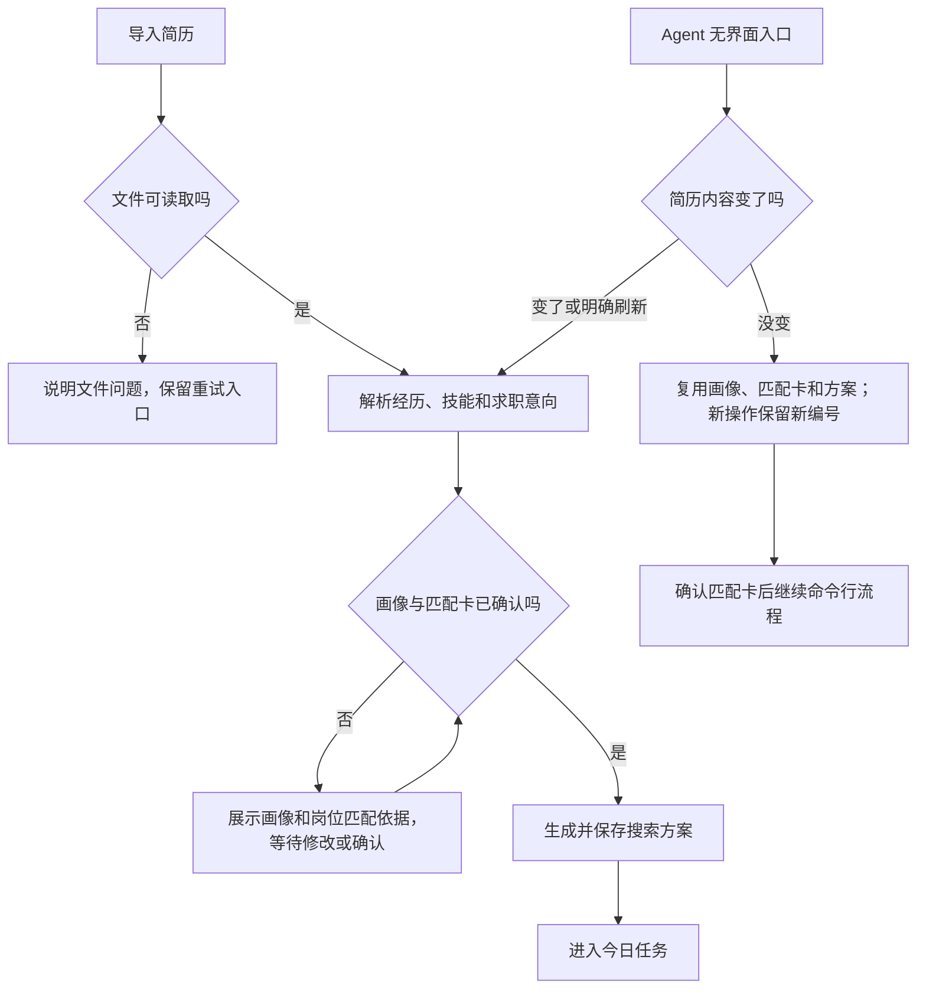

首次使用建立的画像和搜索方案是后续筛选的依据。Agent 运行项目走命令行，不需要打开页面；相同简历的新一轮使用可继续求职流程，而不必重做画像。

## 2. 今日任务

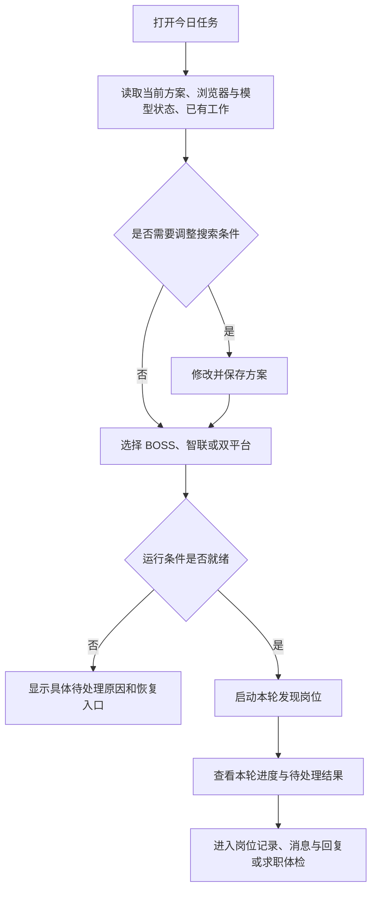

## 3. 发现岗位

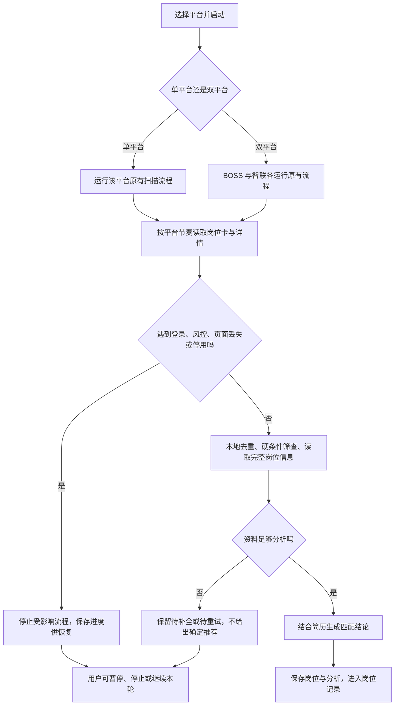

双平台只是并行调度两个已有平台流程；每个平台内部依然按自己的节奏顺序读取，不同时打开多个岗位详情。

## 4. 岗位记录

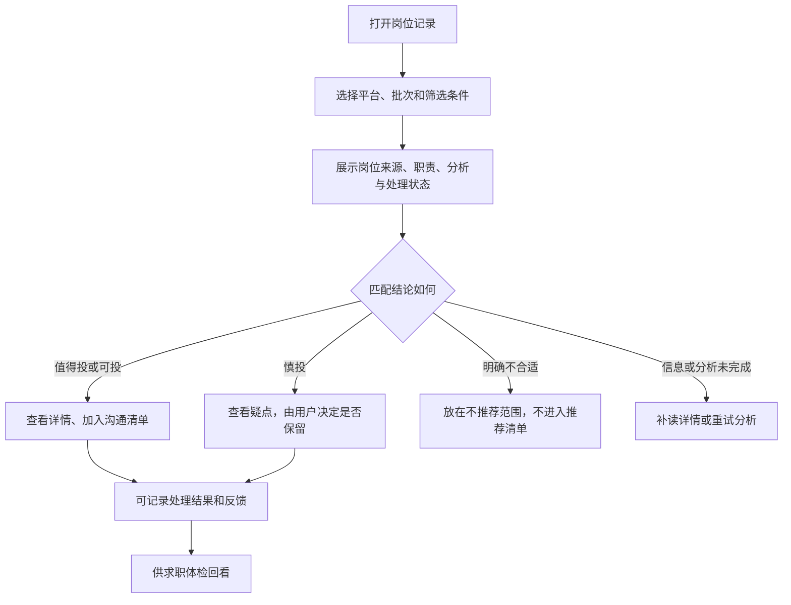

## 5. 求职体检

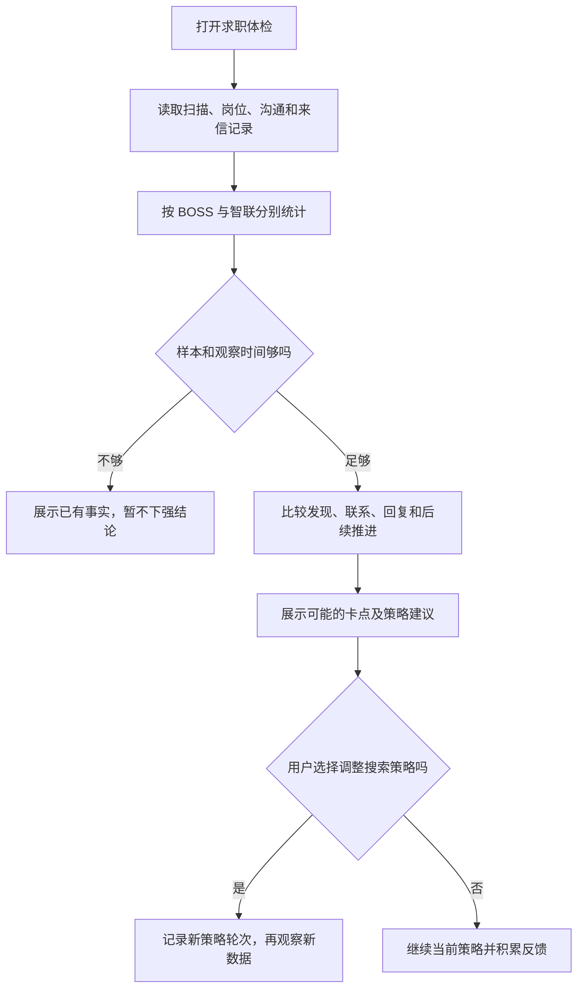

这里的“体检”依赖真实记录；未发生的投递、面试或录用结果不能凭空推断。

## 6. 消息与回复

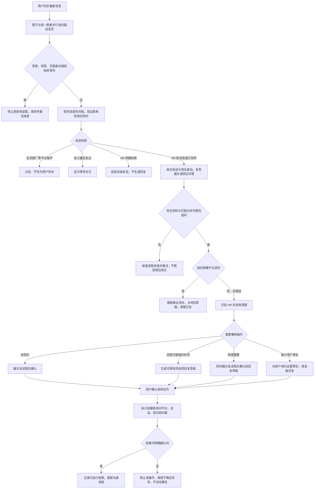

“打过招呼”只说明产生了会话，不代表岗位适合。当前新增的匹配门槛只静默过滤分析已完成且明确不推荐、存在硬性冲突的岗位；慎投和信息不足不会被误判为不合适。历史消息仍保留在本地记录中，但不合适岗位不再占用待处理列表，旧回复草稿也禁止发送。

## 7. 沟通清单与记录

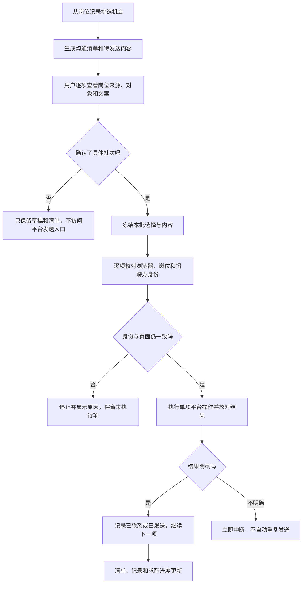

## 8. 简历工作室

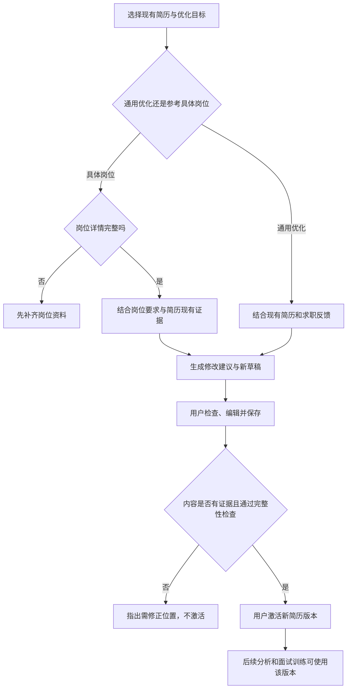

## 9. 面试训练

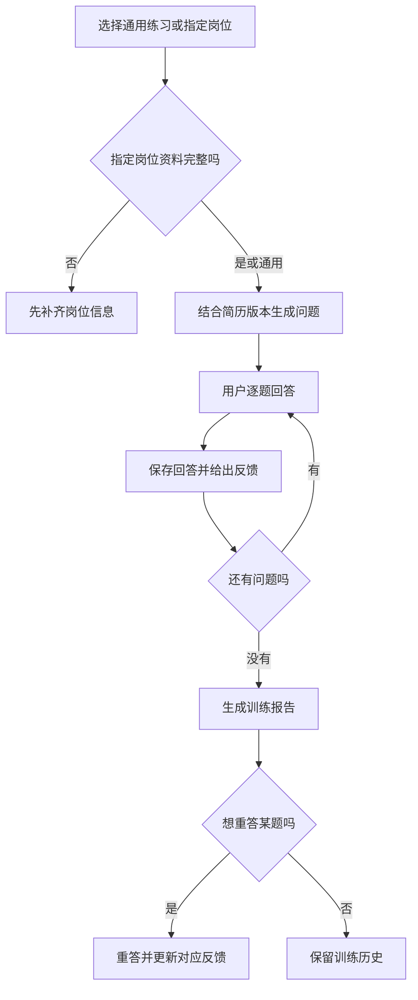

## 10. 招聘平台

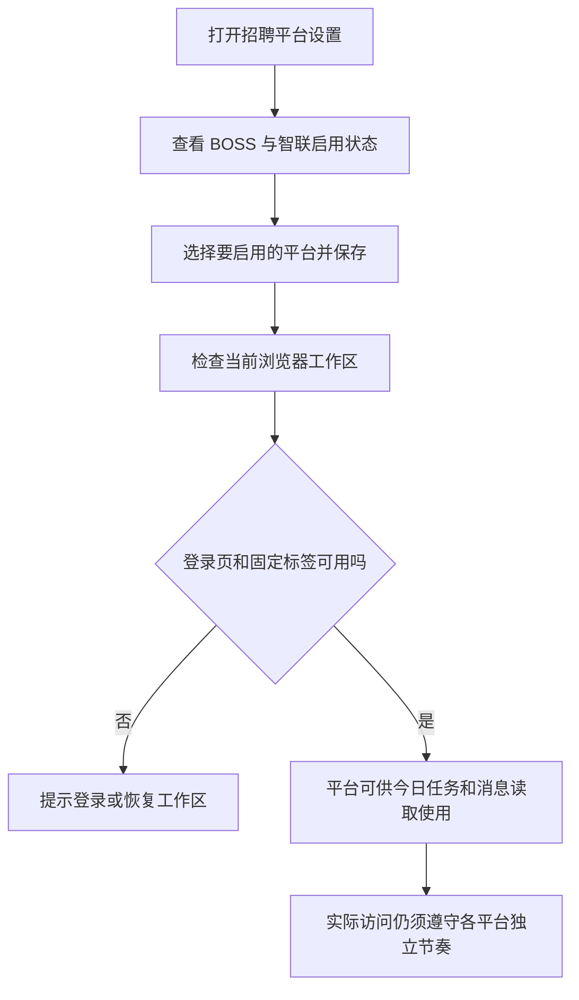

## 11. 模型与设置

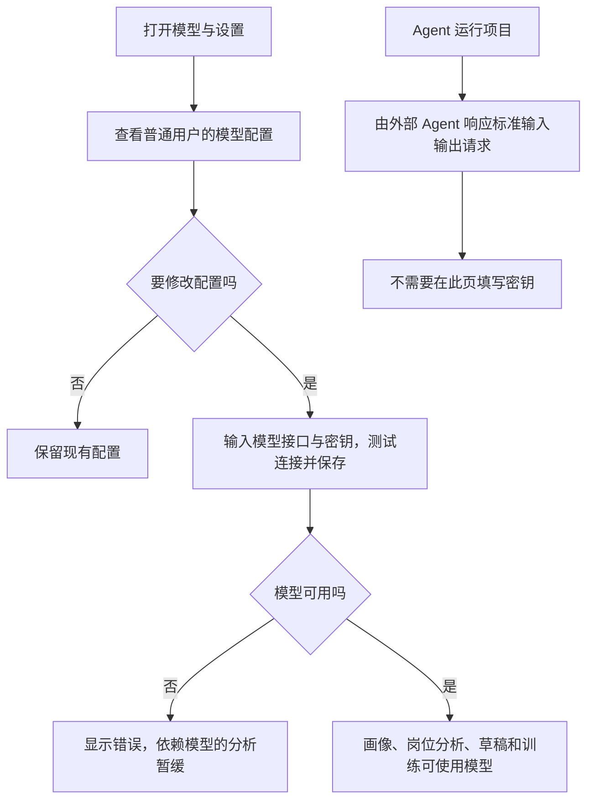

## 12. 运行诊断

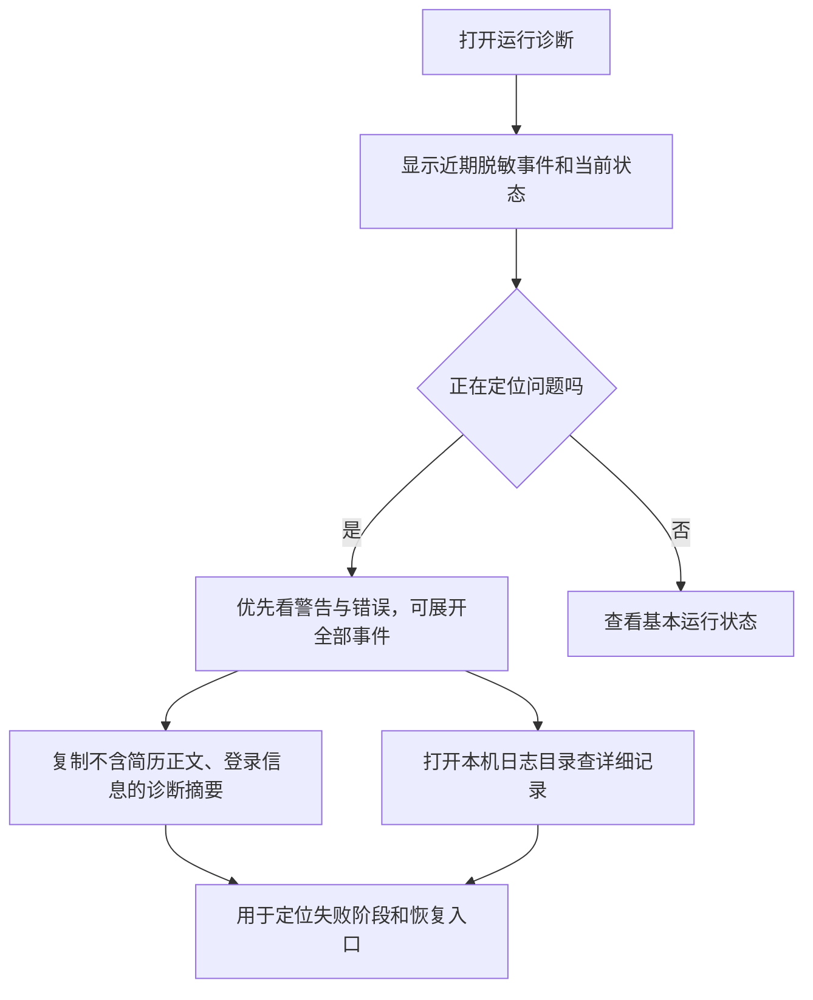

## 模块之间怎样衔接

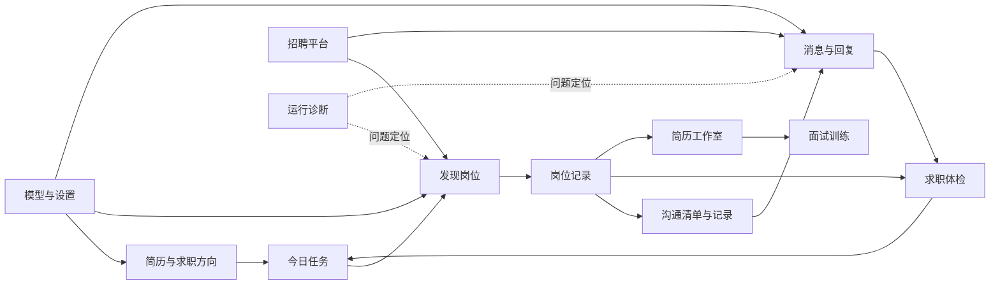

这些图是当前实现的路径说明，不保证外部招聘平台永远提供完整页面。如果页面不可读或安全状态无法确认，系统会停止相关读取并保留进度；它不会据此猜测岗位匹配，也不会代替用户确认对外发送。
