# OfferGo 产品流程说明与模块流程图

这份报告按普通用户的一次求职过程来讲，再拆开说明侧栏的 11 个模块和首次使用入口。每张图都从左到右或从上到下阅读：方框是系统或用户做的事，菱形是一个需要判断的条件，箭头上的文字是判断结果。图后面的“你会看到什么”说明最终出现在页面上的结果。不同模块之间的连接见文末总图。

先区分三个容易混淆的动作：

| 动作 | 要回答的问题 | 什么时候发生 |
| --- | --- | --- |
| 岗位匹配 | 这份岗位是否符合你的求职方向、简历和硬性条件？ | 首次发现岗位，或已有结论确实过期时 |
| 会话身份核对 | 当前消息仍然来自原来的平台、招聘方和岗位吗？ | 每次读取新消息，以及执行发送前 |
| 消息理解 | HR 这次说了什么，要发简历、回答问题，还是不需要回复？ | 有尚未处理的新消息时 |

**HR 再次回复 ≠ 重新匹配岗位。** 会话身份核对是防止把消息或简历发错对象；消息理解只处理这一次的新内容。岗位匹配结果若仍有效，系统直接复用。

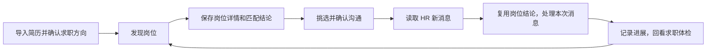

平台页面和消息的读取是只读操作。投递、打招呼、发简历和发送回复会改变平台状态，都需要用户确认具体动作；确认一批沟通不会自动授权以后所有消息。

## 1. 首次使用：建立求职方向

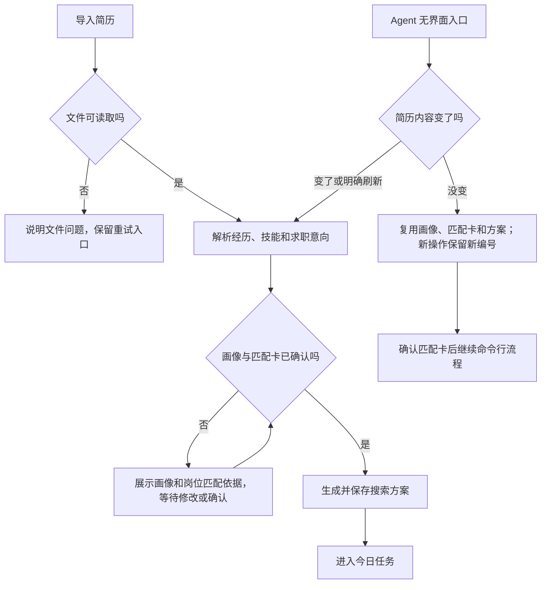

首次使用建立的画像和搜索方案是后续筛选的依据。Agent 运行项目走命令行，不需要打开页面；相同简历的新一轮使用可继续求职流程，而不必重做画像。

你会看到：普通用户确认画像和方向后进入“今日任务”。Agent 用户得到可供继续扫描的结构化结果；同一操作编号用于重试，新一轮使用换新的操作编号。

## 2. 今日任务

这一页是入口，不负责重新分析已经完成的岗位。它让你检查今天要使用哪个求职方案、哪个招聘平台，再启动一轮工作。

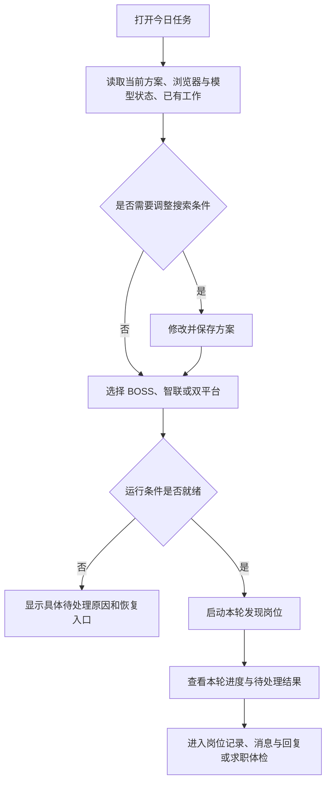

你会看到：尚未开始时的可执行事项、运行中的进度，以及需要恢复时的原因。选择“双平台”会调度两套现有的平台流程；它不等于在同一个平台内同时操作多个岗位。

## 3. 发现岗位

这一模块处理“找工作机会”，不是读取 HR 消息。它先取得岗位资料，再结合简历做一次匹配，把岗位保存到“岗位记录”。

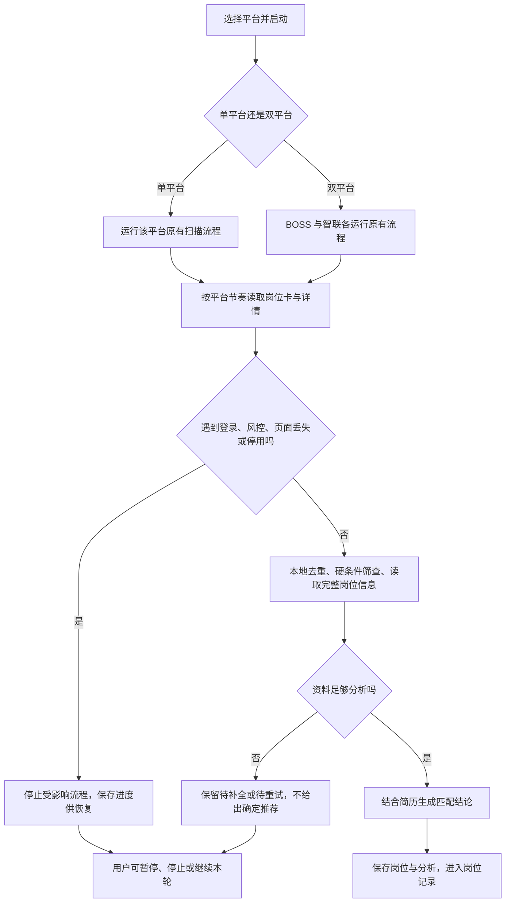

双平台只是并行调度两个已有平台流程；每个平台内部依然按自己的节奏顺序读取，不同时打开多个岗位详情。

你会看到：已分析岗位进入不同推荐范围；详情未读全或分析失败的岗位保留进度，后续补读。平台登录、页面身份或风控异常时受影响的读取停止，不把猜测当作岗位结论。

## 4. 岗位记录

这里是岗位档案，而不是消息待办。相同岗位再次出现时，既有历史和处理记录仍可查看；岗位资料或求职方向有变化时，分析可能需要更新。

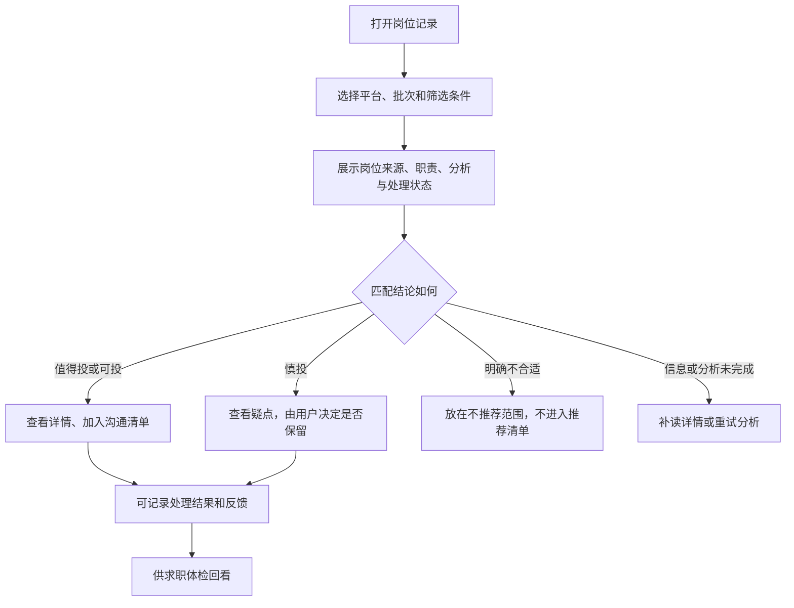

你会看到：岗位来自 BOSS 还是智联、主要职责、当前匹配结论、已联系或待处理状态。查看岗位、保留岗位和选择沟通是不同操作；单纯查看不会发送消息。

## 5. 求职体检

它回看此前实际发生的发现、联系、回复等记录，帮助判断求职过程卡在了哪一段。建议依赖样本和观察时间，不能把“暂时没有回复”直接当作岗位拒绝。

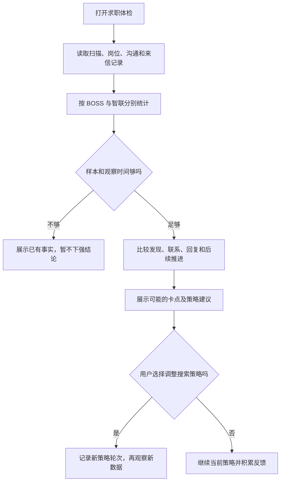

这里的“体检”依赖真实记录；未发生的投递、面试或录用结果不能凭空推断。

你会看到：按平台分开的数据、阶段变化和可解释的建议。如果改变搜索方向，新的策略作为下一轮观察的起点，而不是改写旧一轮的结果。

## 6. 消息与回复

这一页解决两个问题：**先发现现在有什么新消息，再告诉你每条消息需要什么动作。** 它不会因为出现一条新回复就默认重跑岗位匹配。消息按平台顺序读取；单个平台内逐条处理，并保存进度。

### 第一步：找出真正需要处理的新消息

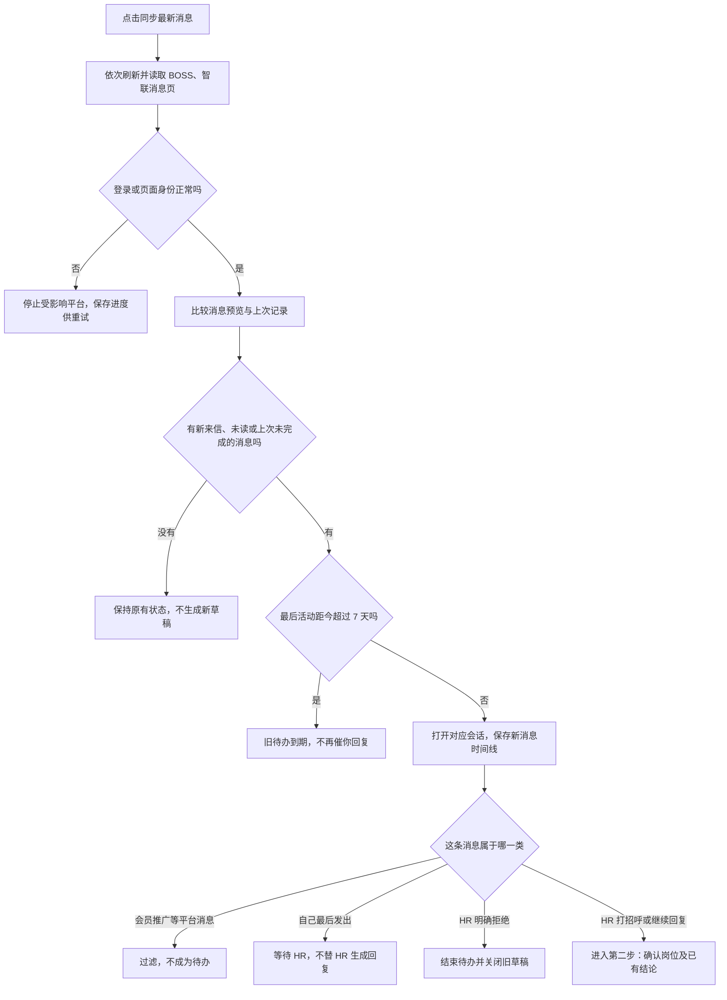

**打招呼与继续回复都要看岗位结论，但处理方式不同。** 如果这份岗位先前已经分析过，系统取原来的结论；如果 HR 主动联系了一份从未见过的岗位，系统才先补全岗位资料并做首次匹配。超过一周的旧消息不会被重新变成要求你回复的待办。

### 第二步：复用匹配结果，必要时才重新分析

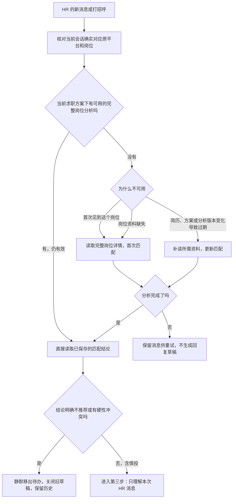

**“核对岗位”不是“再做匹配”。** BOSS 会核对选中的会话指向哪个岗位和浏览器标签是否安全；智联也会核对目标岗位，并可能更新岗位是否仍在线。这些是每次读消息都需要做的身份与状态检查。只有图中“没有可用完整分析”的分支才会调用岗位分析模型。一个历史结果虽然还在数据库里，如果其对应分析被标为过期，就不能当作当前有效结论；例如本机检查到一份旧岗位因模型推理版本变化被标记为过期。

### 第三步：理解这次消息，给出用户需要的动作

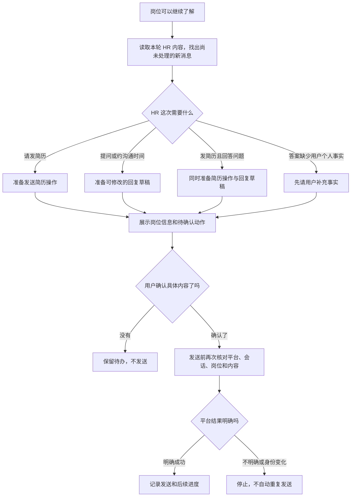

这一步可能重新生成**消息回复草稿**，因为 HR 问了新问题；它不会因此重新生成**岗位匹配结论**。已经处理过的消息可作为上下文，但不会重复记成一条新待办。识别简历邀请后，界面应提供相应的发送确认；如果 HR 同时提出问题，还会展示回复草稿。任何对外发送都要你确认，系统不会自动替你回复。

| 具体情境 | 岗位匹配会怎样 | 页面结果 |
| --- | --- | --- |
| 你先打招呼，已匹配的岗位收到 HR 第一次回复 | 复用原匹配结论；只理解 HR 新说的话 | 合适或慎投则给出对应动作；明确不合适则静默收起 |
| 同一 HR 又回复了一个新问题 | 仍复用有效结论；不重新读完整岗位详情 | 仅为新问题准备新回复或其他动作 |
| HR 主动发来陌生岗位的招呼 | 先读岗位职责和要求，做首次匹配 | 不合适则静默；可聊才进入待办 |
| 简历、搜索方案或分析版本变化使旧结论过期 | 更新匹配一次，之后复用新结论 | 更新完成前不依据旧结论生成新草稿 |
| 消息没有变化 | 不重新匹配，也不重新生成草稿 | 保持原有等待或待办状态 |

如果旧分析确实过期，而本次更新又失败，后续同步可能继续尝试恢复。这是“未完成任务的重试”，不是“每有一条 HR 回复就重新匹配”。

你会看到：待处理的可聊消息、等待对方的会话和对应的动作。明确不合适的岗位不占用待办，旧回复草稿不能再发送；慎投岗位不会被静默丢弃。历史消息仍保留在本地记录中。

## 7. 沟通清单与记录

这个模块处理你主动联系岗位的计划和执行记录。选中一个岗位，只是把它放进清单；系统会先让你检查本次准备联系谁、准备发什么。确认的是这一批具体岗位，不是以后的所有沟通。

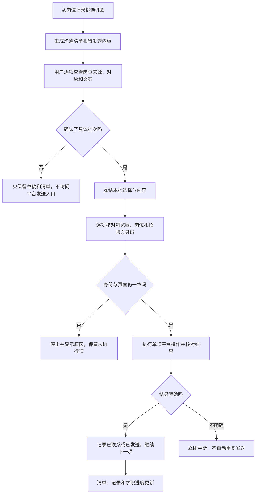

你会看到：每条岗位的来源平台、待确认内容、执行状态，以及成功、停止或结果不确定的记录。某条发送结果无法确认时，系统不会自动重发；这是为了避免重复打招呼。

## 8. 简历工作室

这页处理简历内容，不执行投递。你可以围绕整体求职方向优化，也可以参考一份资料完整的岗位。系统只能把已有经历写得更清楚，不能把缺乏证据的经验写成你做过的事。

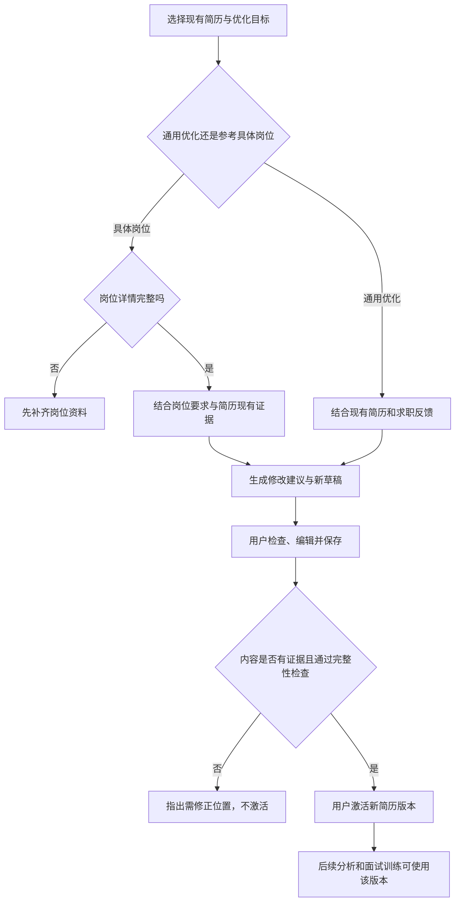

你会看到：修改建议、草稿、原简历证据和版本历史。保存草稿与激活新版本分开；只有你选择激活后，后续使用才会采用这个版本。更换有效简历版本可能使先前的岗位匹配需要更新。

## 9. 面试训练

通用练习依据当前简历和求职方向；指定岗位练习还要有完整岗位资料。每道题先由你回答，系统再给反馈，最后汇总这轮训练。

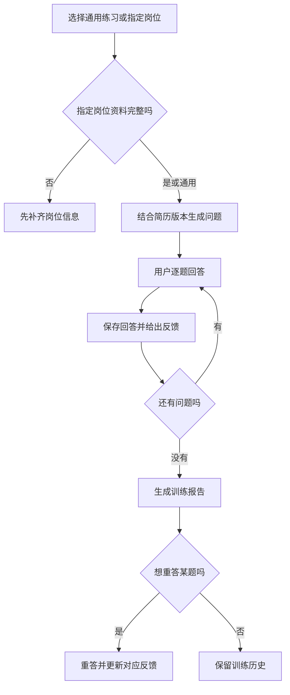

你会看到：当前问题、答题反馈、训练报告和历史记录。训练中的回答不会自动发给招聘平台，也不会自动修改你的简历。

## 10. 招聘平台

这里决定工作区准备 BOSS、智联中的哪几个平台，以及相应浏览器页面是否可用。平台登录属于平台自身页面；OfferGo 依赖你现有的登录状态读取岗位和消息。

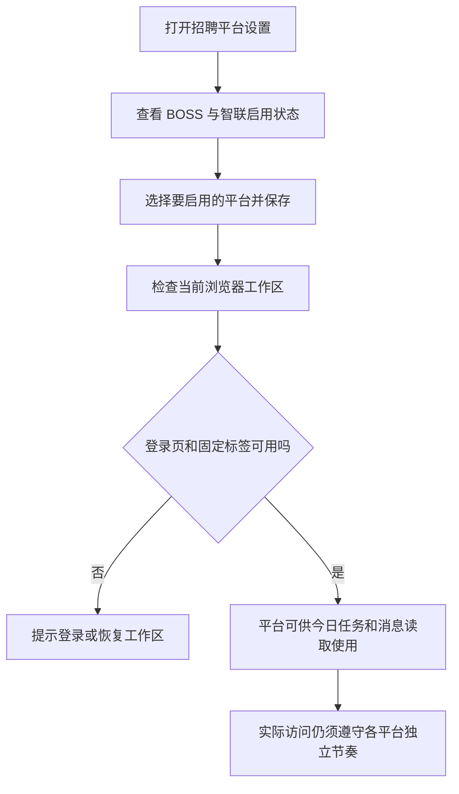

你会看到：每个平台的启用状态和需要登录、恢复浏览器等提示。启用两个平台后，搜索可以调度双平台；消息同步仍按平台逐一读取。

## 11. 模型与设置

普通用户可以填入自己的模型接口与密钥，供画像、岗位分析、回复草稿等功能使用。让 Agent 直接运行项目时，Agent 自己响应命令行请求，不需要你来这个页面配置一个“Agent 提供商”。

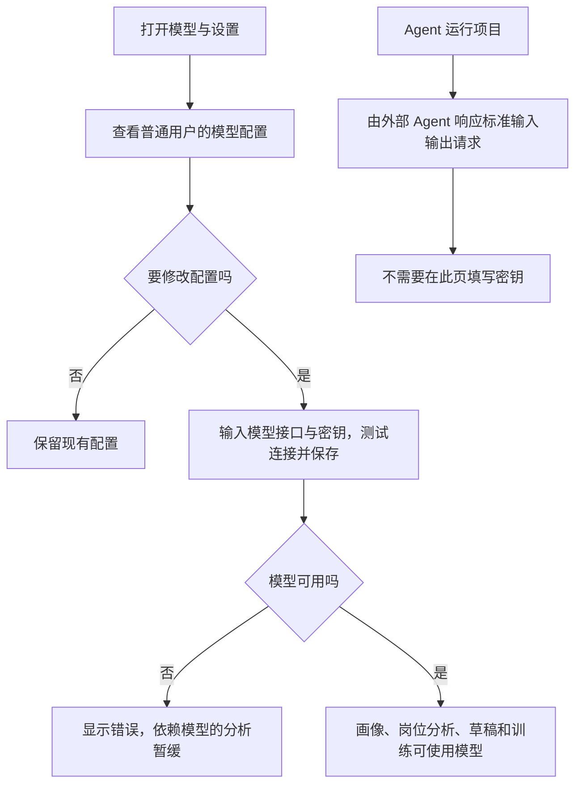

你会看到：配置是否可用，以及模型连接失败时的具体提示。修改模型或分析配置后，旧岗位结论可能被标记为过期；下一次确实需要它时才更新，不是每收到一条 HR 消息都重跑。

## 12. 运行诊断

这里是排查异常的入口：看最近发生了什么、哪个阶段失败、是否需要恢复浏览器或查看日志。它不是普通求职操作页。

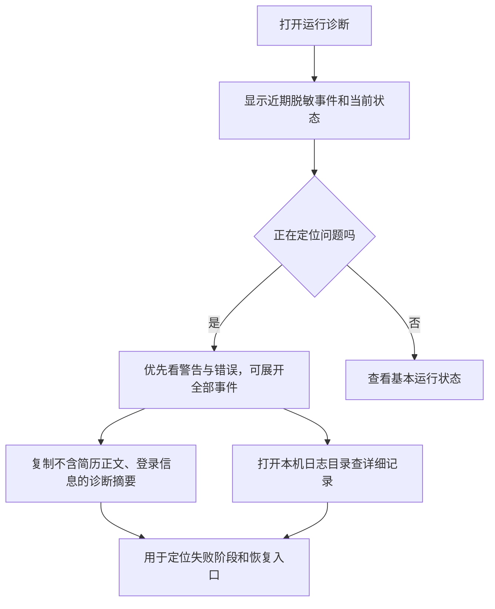

你会看到：最近的警告、错误和脱敏运行信息。复制诊断摘要用于定位问题，不会把简历正文或登录凭据打包进去。

## 模块之间怎样衔接

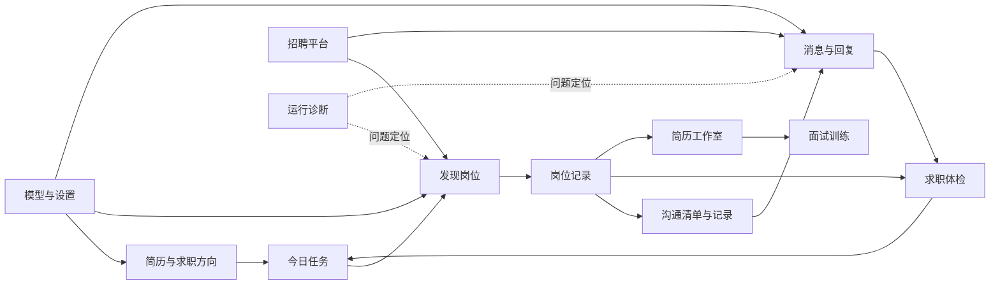

这些图说明当前代码中的主要产品路径，不代表外部招聘平台永远提供完整页面。如果岗位资料不可读或安全状态无法确认，系统会停止受影响的读取并保留重试进度；它不会凭岗位标题猜测匹配结论，也不会代替你确认对外发送。

## 核对依据与阅读边界

- 消息队列如何判断新消息、未读和一周外的旧消息：`src/core/message_preview_state.js`、`src/core/message_discovery.js`。
- BOSS、智联如何复用同一求职方案下的完整岗位分析：`src/application/message_discovery/job_context.js`、`src/application/message_discovery/zhaopin_job_context.js`。
- 明确不适合岗位如何移出消息待办，旧草稿如何关闭：`src/core/message_routing_policy.js`、`src/core/message_discovery.js`、`src/dashboard/message_discovery_controller.js`。
- 用户确认后如何逐项核对并执行对外操作：`src/application/message_reply_sending/`、`src/application/message_actions/`、`src/application/communication/`。

这里画的是用户能理解的主要分支，不逐行展示浏览器等待、访问预算、数据库状态等内部步骤。它们仍在执行，但不改变“有效岗位匹配复用，只有缺失或过期才更新”的判断。
