# 看懂 OfferGo：从简历到求职结果的项目地图

本页说明**当前仓库源码**实际怎样工作，核对基线为 `d0716e8`。它不是公开 `v1.3.2` 安装包的功能承诺，也不是对招聘网站当前页面的现场验收。想看某个页面的更细分支，可接着读[各模块详细流程](offergo-product-module-flows.md)。

建议按顺序看：先看两张架构图，知道 OfferGo 与外界的边界；再看一次使用的全程和两种入口；最后看找岗、沟通、消息、复盘与异常处理。每张图只回答一个问题。

## 用什么工程图读懂这个项目

| 工程图法 | 它回答什么 | 本页位置 |
| --- | --- | --- |
| [C4 系统上下文图](https://c4model.com/diagrams/system-context) | OfferGo 的边界在哪里？谁使用它？它依赖哪些外部系统？ | 架构图 A |
| [C4 容器图](https://c4model.com/diagrams/container) | 本地网页、命令行程序与数据文件怎样协作？ | 架构图 B |
| 活动流程图，参考 [UML 活动](https://www.omg.org/spec/UML/2.5.1/PDF)的分支表达 | 从简历到找岗、消息、复盘，各步和判断是什么？ | 图 1～6、8～11 |
| [UML 时序图](https://www.omg.org/spec/UML/2.5.1/PDF)风格 | 一次主动联系先后由谁发起、核对和执行？ | 图 7 |
| [UML 状态机图](https://www.omg.org/spec/UML/2.5.1/PDF)风格 | 长任务在运行、暂停、完成和中断间怎样变化？ | 图 12 |
| 资料关系图 | 哪些内容留在本机，供之后复用？ | 文末资料图 |

C4 是软件架构的通用表达方法，不是数据库或浏览器技术；它的“容器”指独立运行的应用或数据存储，**不是要求使用 Docker**。[C4 官方建议](https://c4model.com/diagrams)按需要选图，系统上下文图和容器图通常已足够。UML 是 OMG 发布的建模规范；本页用 Mermaid 绘制可读的**相应视角或风格**，不宣称每条线都符合 UML 的完整语法，也不把普通流程图冒充 [BPMN 业务流程标准](https://www.omg.org/spec/BPMN/2.0.2/PDF/)。Mermaid 在这里是画图工具，不是架构规范。

读图时按这些约定看，符合 [C4 的图例建议](https://c4model.com/diagrams/notation)：

1. **一图一问。** 总图只讲全程；具体判断放到对应分图，避免一张图里交叉几十条线。
2. **符号固定。** 流程图中方框是动作或结果、菱形是判断；状态图中方框是状态；时序图从上到下表示先后。分叉箭头写清“是/否”“成功/失败”；虚线只用于可选或间接关系。
3. **动作有主人。** 会引起误解的节点明确写“你”或“OfferGo”；“可以”“你点击后”和“系统自动做”必须分开。
4. **出错有去处。** 每条会影响结果的失败分支都画到“保留待办”“停止”“可继续”或“需核验”，不悬空。
5. **发送单独画。** 选中、确认清单、开始执行、核对目标、确认结果是不同动作，不能缩成一个“处理”。
6. **只画当前实现。** 图外标出代码依据和已知能力边界；源码或现场验收与图冲突时，修图，不把愿望当事实。

## 架构图 A：OfferGo 与外界的关系（C4 系统上下文视角）

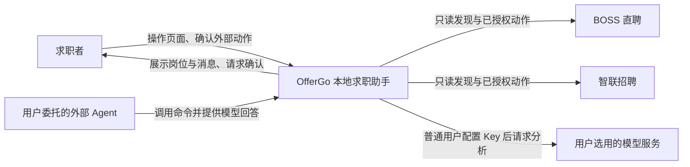

**边界：**OfferGo 是中间的本地软件；求职者、外部 Agent、招聘平台和模型服务都在边界外。箭头表示谁向谁提出操作或交换信息，不表示 OfferGo 可以未经确认替你联系 HR。Agent 路线由当前 Agent 提供分析能力，普通页面路线由用户配置模型服务。此图刻意不画内部文件和页面，先让你看清项目负责什么、不负责什么。

## 架构图 B：本机上哪些部分在工作（C4 容器视角）

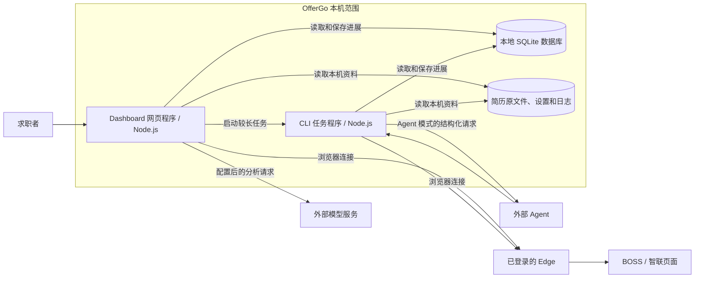

Dashboard 是本地网页程序，CLI 是处理命令和后台任务的程序；它们共用项目代码，但可作为不同进程运行。SQLite 保存结构化记录，简历原文件、设置和日志在本机其他文件中；图中的数据存储不代表只存在一个文件或一定在同一目录。Edge、招聘平台和外部模型服务画在 OfferGo 边界外。`application`、`core`、`adapters` 是代码内部职责，**不是另起的服务或进程**。两个入口只有指向同一数据目录才真正共享记录。

## 图 1：一次使用的全程

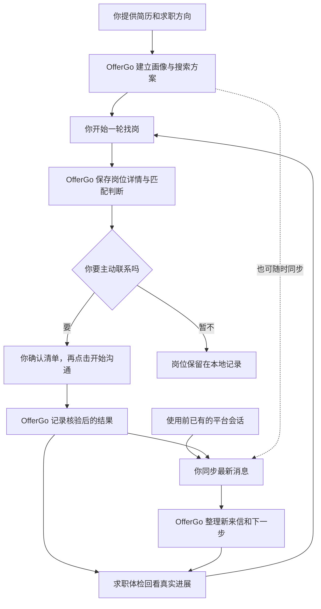

**你得到什么：**一份可反复使用的求职方向、岗位记录、沟通与消息进展，以及下一轮调整的依据。找岗不会自动打招呼；HR 来信也不要求一定先经过 OfferGo 的主动沟通。简历工作室和面试训练是辅助路线，见图 11。

## 图 2：两种入口，共用一套求职规则

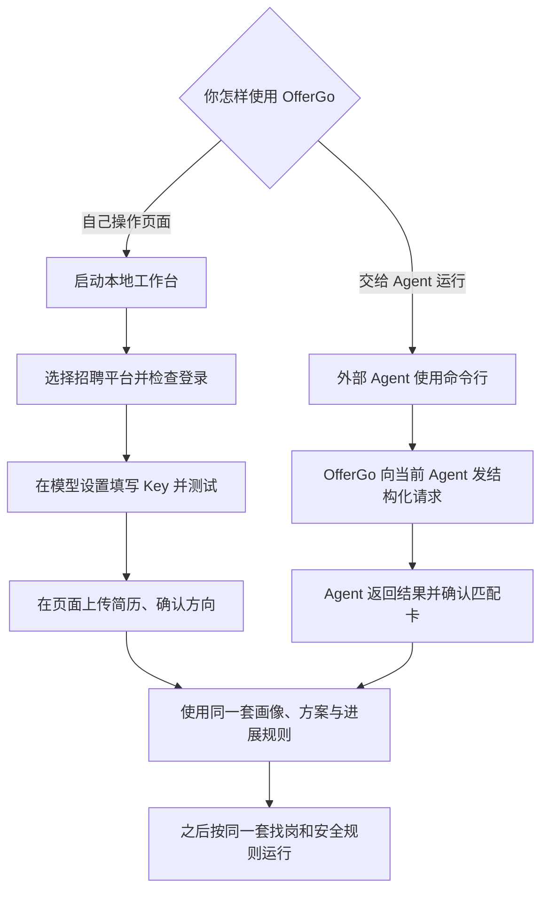

**区别主要在入口和模型由谁提供。**普通用户在本地页面配置 API Key，也就是模型服务的访问密钥；Agent 不打开前端，也不在模型设置里登记“Agent 提供商”，由正在运行项目的外部 Agent 回答命令行请求。

两种入口使用同一套数据规则；**只有指向同一个数据目录，才会读取同一份实际记录**。Agent 在同一数据目录重新使用相同简历时可复用画像、匹配卡和方案；下一轮找岗仍是新一轮。外部沟通权限不会因为用了 Agent 而放宽。

## 图 3：看源码时，各部分负责什么

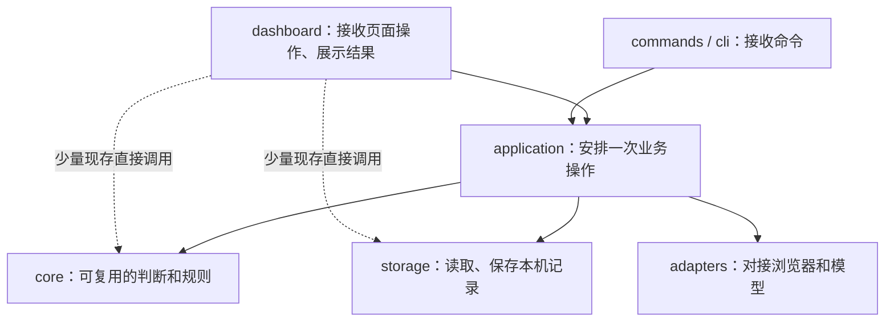

这是**源码职责图**，不是又一张 C4 容器图。读源码时先看入口，再看某次操作的安排和判断，最后看数据与外部接口。箭头表示主要调用方向；虚线表示当前仍存在的跨层直接调用，所以它不是一幅“理想分层已全部完成”的示意图。Dashboard 会让独立进程处理扫描等耗时任务，页面可以持续显示进度；图里不重复画进程和浏览器，它们已在架构图 B 中。

交付方式也要和使用流程分开看：公开的 `v1.3.2` 安装包仍用旧名称 RoleFlow 和旧图标；本页描述的是仓库中的较新 OfferGo 源码。普通用户从安装包启动本地工作台；源码或便携版也能启动工作台；把源码交给 Agent 时走 CLI。程序升级和更换安装位置不等于清空用户资料，现有安装兼容数据目录仍叫 `%LOCALAPPDATA%\RoleFlow`。Agent 若指定另一数据目录，就不会自动看到安装版里的那些记录。

## 图 4：第一次建立求职方向，之后何时复用

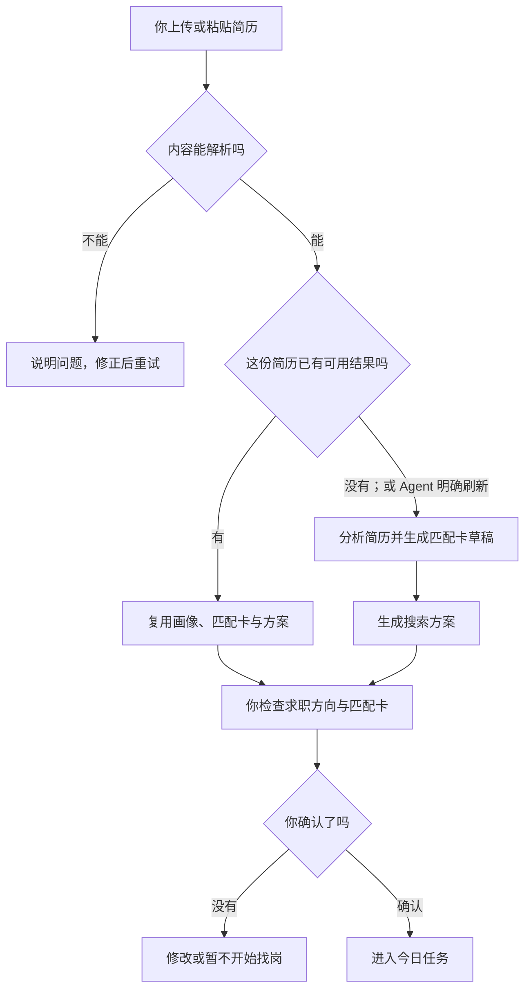

**画像**是从简历整理出的经历与能力；**匹配卡**说明哪些能力和岗位条件应被重视；**搜索方案**保存找岗范围和关键词。系统先生成草稿与方案，用户再确认匹配卡。相同简历在同一数据目录的新一次 Agent 使用会得到新的操作编号，但不等于重新分析；明确刷新时才重做。失败任务从已保存的阶段继续，不能把“重试”理解成新建一整套资料。

## 图 5：一轮找岗怎么跑

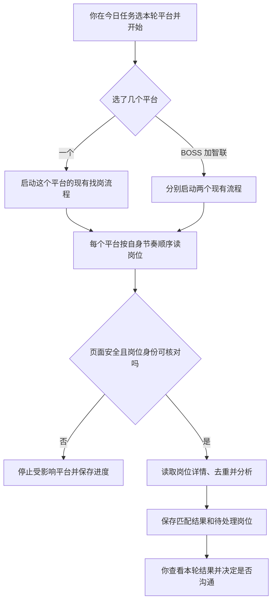

“双平台”只是同时调度 BOSS 和智联各自原有的流程；**同一平台内部仍顺序读取，不并发打开多个岗位**。一个平台启动失败时，另一个可能已运行，状态会分别显示。登录、风控、页面丢失或身份对不上时，受影响的读取会停下，已保存的工作可按状态继续。

## 图 6：岗位为什么会进入不同列表

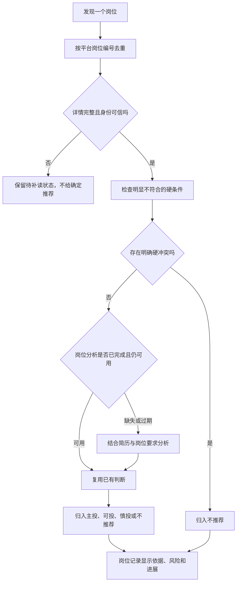

**同一岗位再次出现，不等于重新匹配一次。**详情、简历、方案或分析版本使旧结论不可用时才更新。主投、可投、慎投是不同的推进建议；明确不适合的岗位留在不推荐范围。详情不完整、模型暂不可用或分析失败会保留待处理状态，不把缺失资料伪装成“适合”。岗位记录和当前待处理视图都读取这些本地记录；单纯查看或标记本地进展不会替你向平台投递。

## 图 7：一次主动联系先后由谁负责（UML 时序图风格）

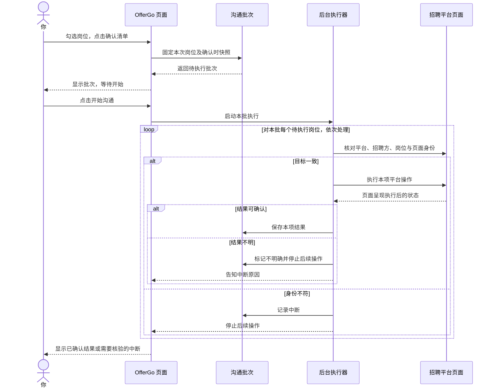

时序图**从上往下读时间**，横向看“谁在做”。**确认清单是固定本次范围；开始沟通才启动平台动作。**执行时仍逐项核对目标和结果。图中平台返回的“可核验结果”是一种成功分支；若页面结果不明，不能当成失败而自动再点一次。这里是主动联系岗位的批次；已有 HR 会话走下面的消息流程。

## 图 8：同步消息时，哪些会成为待办

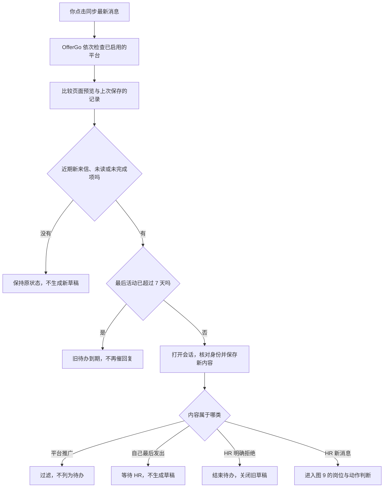

首次同步会考虑**近 3 天**内符合条件的既有 HR 来信，让刚开始使用 OfferGo 的人不漏掉近期对话；未读和上次未完成的消息有各自的优先规则。**7 天**是待回复动作的时限，不是删除聊天记录。BOSS 与智联依次处理，不同时操作两个消息页。某个平台无法可靠读取时，保留未完成状态供重试；不能把一次同步称作“已读完所有会话”。

## 图 9：HR 新消息怎样变成下一步

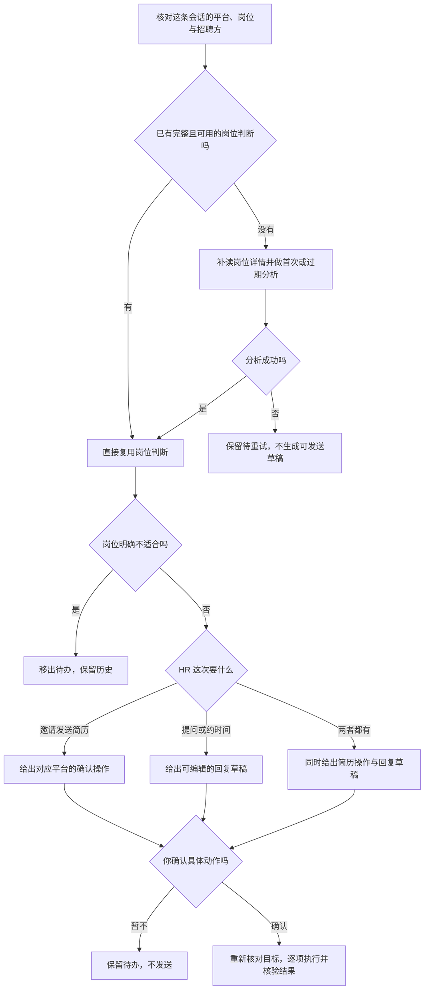

**核对会话身份不是重做岗位匹配。**已分析过且仍有效的岗位直接复用结果；陌生岗位或旧分析确实不可用时才补资料、分析。HR 的新问题可能需要新草稿，但不会因此重新画像。回复草稿可以修改，缺少个人事实时会先要求补充。

BOSS 当前支持对识别出的简历邀请确认发送在线简历；智联支持接受或拒绝识别出的邀请。普通文字回复支持按同一平台选择后串行确认发送；每次执行前核对目标，结果不明时停止。

**当前缺口也应看清：**消息页仍保留人工粘贴入口；遇到平台页面无法可靠读取、岗位信息无法补全或模型结果未通过校验时，项目会保留待重试或待判断项。语音、图片和附件消息暂未覆盖。因此“所有有价值消息都能在 OfferGo 内完成，用户完全不用再看平台消息页”还是产品目标，不能当作当前已验证事实。

## 图 10：求职体检怎样给出建议

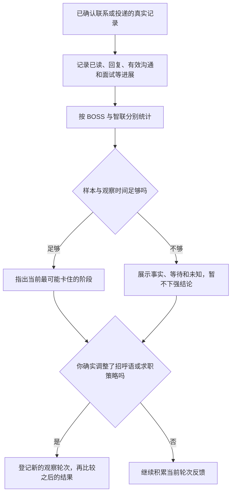

求职体检不是把扫描到的所有岗位直接算成“投递”。诊断样本以已确认的实际沟通、投递和后续进展为基础；部分阶段至少观察 **48 小时**，跨周末顺延。智联没有可靠的“已读”信息时，不虚构已读率。登记新策略轮次只改变后续统计的比较起点，不会替你修改搜索方案或自动发送消息。

主路线以外还有低频入口：今日任务可手动发起广泛扫描、补读缺失详情和更新过期活跃状态；岗位记录可归档、给推荐反馈、导出当前或选中的岗位；无回复跟进页可准备草稿，仍须确认后才发送。沟通资料页保存用户确认过的个人事实和改写后的回答，供后续同类草稿参考。这些都是主流程的补充，不会绕过平台节奏和授权检查。

## 图 11：简历工作室与面试训练用哪些资料

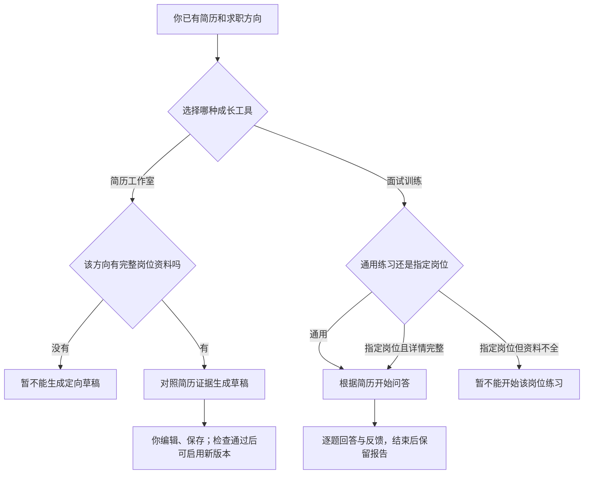

简历工作室目前做的是**有真实岗位参照的定向优化**，没有完整岗位就不能凭空生成；保存草稿和启用新版本是两步。面试训练可以只根据简历做通用练习，指定岗位训练才要求完整岗位资料。完成后重答会新增一条反馈，不覆盖原回答或原报告。这两个模块都不会自行投递或发送消息。

## 图 12：主工作流会停在哪些状态（UML 状态机图风格）

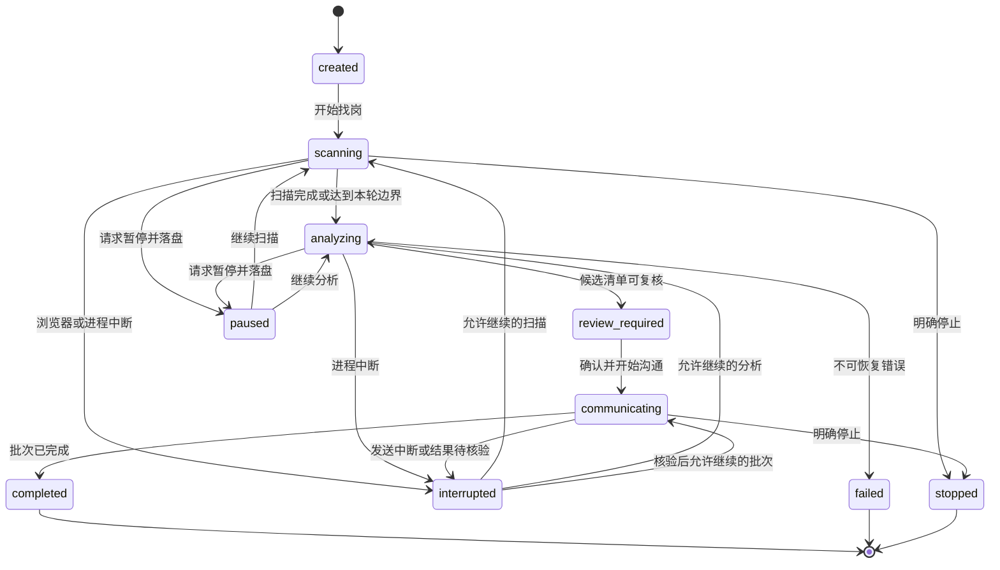

状态名取自[运行生命周期](lifecycle.md)。一项工作先找岗、再分析、到用户复核；用户授权后才可能进入沟通。图只展开主要转换：非终止状态也可能因明确停止进入 `stopped`，或因不可恢复错误进入 `failed`。`completed`、`failed`、`stopped` 是终点，不能当成可继续状态。暂停、浏览器风险和进程中断都会保留已完成进度；恢复必须通过当前状态与身份检查。**读网页失败可在安全条件恢复后继续，外部发送结果不明则绝不能自动重发。**重复开始或继续不应重复创建批次和子任务。“运行诊断”能帮助定位问题，但不自动修复任务。

## 侧栏每一页放在什么位置

| 页面 | 打开它是为了 | 会不会直接改变招聘平台 |
| --- | --- | --- |
| 今日任务 | 选方案、选平台、开始或继续一轮 | 开始找岗只读；不会自动联系 |
| 发现岗位 | 看本轮采集、分析和待确认清单 | 采集只读；另行确认并启动沟通才可能写入 |
| 岗位记录 | 看详情、匹配判断和本地进展 | 查看不会发送；本地标记不等于平台投递 |
| 求职体检 | 按真实进展看卡点、登记策略轮次 | 不会发送或改平台状态 |
| 消息与回复 | 同步新消息，确认简历邀请或回复 | 读取只读；确认具体动作后才会写入 |
| 沟通清单与记录 | 选主动联系岗位，执行并查结果 | 确认清单后仍需点击开始 |
| 简历工作室 | 整理画像、简历版本和定向草稿 | 不会投递 |
| 面试训练 | 根据简历或完整岗位模拟问答 | 不会发送给 HR |
| 招聘平台 | 选择 BOSS、智联或两个平台，检查页面 | 保存选择不会开始扫描 |
| 模型与设置 | 普通用户配置、测试模型连接 | 不访问招聘平台 |
| 运行诊断 | 查看错误、运行状态和日志 | 只用于排查 |

## 哪些内容会被记住

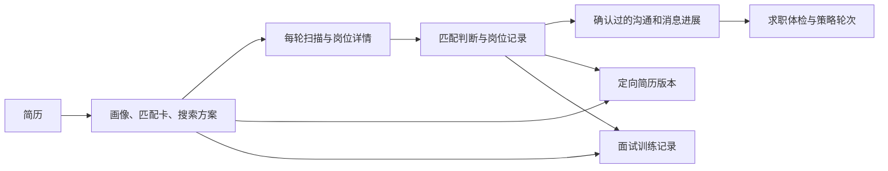

这些记录主要保存在本机数据库；简历原文件、模型设置、浏览器登录资料和日志在各自的本地目录。当前安装兼容目录仍沿用 `%LOCALAPPDATA%\RoleFlow`。同一岗位重新出现会增加新的观察，不应抹掉已投、已跳过或历史消息。更换简历、方案或分析版本可能让旧岗位判断失效，但不会删除旧记录。

本页刻意没有画每个按钮、数据库表或平台页面元素。需要查完整分支时看[模块详细流程](offergo-product-module-flows.md)；需要了解代码组织与状态负责人时看[架构说明](architecture.md)和[运行生命周期](lifecycle.md)。

## 当前代码核对入口

| 图 | 主要代码依据 |
| --- | --- |
| 架构图 A～B | `src/dashboard/server.js`、`src/cli.js`、`src/application/`、`src/storage/`、`src/adapters/` |
| 1～4 | `src/dashboard/ui/navigation.js`、`src/application/onboarding/`、`src/dashboard/server.js`、`src/application/onboarding/agent_onboarding.js` |
| 5～6 | `src/application/workflow/`、`src/dashboard/view_models/today.js`、`src/core/job_analysis.js`、`src/dashboard/server.js` |
| 7 | `src/application/communication/`、`src/dashboard/pages/communication.js` |
| 8～9 | `src/core/message_discovery.js`、`src/core/message_preview_state.js`、`src/application/message_discovery/`、`src/application/message_actions/`、`src/dashboard/message_discovery_view.js` |
| 10 | `src/application/funnel_analysis/`、`src/dashboard/pages/funnel.js` |
| 11 | `src/application/resume_optimization/`、`src/application/mock_interview/` |
| 12 | `src/application/workflow/`、`src/core/workflow_analysis_executor.js`、`src/dashboard/pages/workflow.js`、`docs/lifecycle.md` |

图描述当前设计和源码路径；真实 BOSS、智联页面是否仍可读取、某次发送是否成功，仍以当次页面身份核验和运行结果为准。
