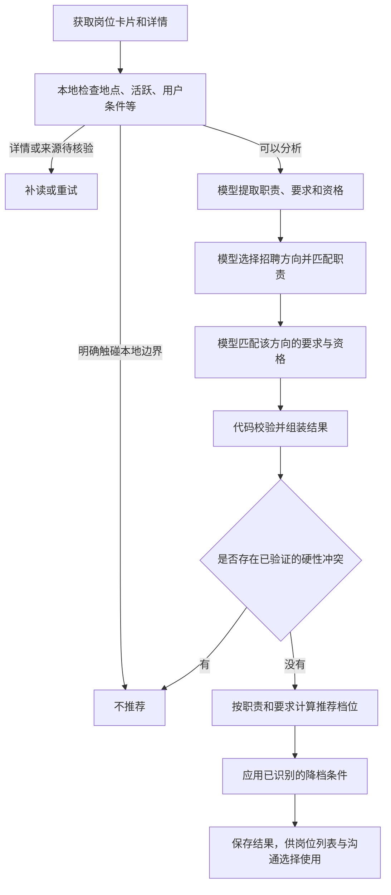
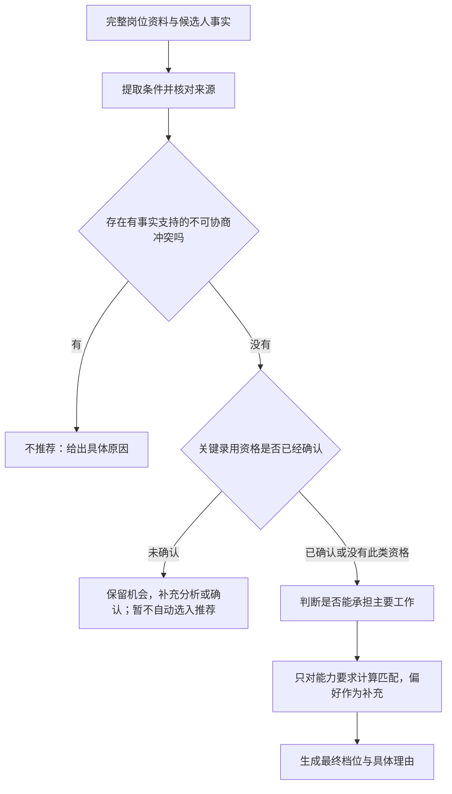

# 岗位筛选模块设计审查

## 当前核对：先分析效果，再决定改动范围（2026-10-10）

用户最新要求优先于此前设计提案：不能机械补关键词，也不能听到“模型判断”就立即切换实现。先详细分析现方案及实际数据，比较局部优化、部分调整与重构，明确目标和有效性证据后才实施。本次核对不改产品代码、不改数据库、不切换运行环境、不调用模型或招聘平台。检查源码为 `1b8335f2c2108040959379125e9ade73c4496eb7`；以下数据分别标明产生版本，不能混作当前版本的效果。

### 1. 当前究竟怎样判断岗位

当前正常单方向链路是：本地条件检查 → 模型理解 JD → 模型选择方向并逐项匹配职责 → 模型逐项匹配任职要求与资格 → 程序重新校验资格、计算方向与评分 → 程序生成四档推荐 → 保存 → 页面分桶。通常是三次模型请求，而不是一次完整的人岗判断。

模型确实在理解与逐项匹配，不是完全没有使用模型。问题是整体判断职责被拆散：职责模型与要求模型都被明确禁止输出整体推荐；要求模型没有完整 JD、原职责和前段职责结果。`legacy` 路径虽有整体建议，但它只作旁观记录，也不能决定最终档位。

程序除了必要的数据验证，还承担了语义判断：调用前按届别/在校条件排除；匹配前按本地资格判断剔除方向；校验时重新解释条件并覆盖模型资格状态；按职责覆盖和70/30要求分生成最终档位；读取时还可能重新分桶。因此，只改提示词、加一个“毕业日期”字段、或打开整体建议字段，都不足以使完整链路采用模型判断。

只读控制试验证实了覆盖行为：固定一份实际岗位的其他分析，分别把输入建议设为优先、可投、慎投、不推荐，生产 `decideJobMatch` 四次均返回优先、来源为加权矩阵。这证明代码不采用该建议；这是人为控制的代码复现，不是模型实际给出了四个不同建议，更不能据此统计模型准确率。

源码核对点：`src/adapters/models/structured.js:341`、`:368`、`:383`；`src/core/split_semantic_matching.js:236`；`src/core/model_contract.js:57`；`src/core/job_analysis.js:427`；`src/core/job_match_decision.js:84`；`src/storage/job_store.js:781`；`src/core/scoring.js:341`。

### 2. 已有数据说明什么，不能说明什么

| 数据 | 实际结果 | 有效结论与限制 |
|---|---|---|
| 余额恢复后的119份岗位快照，源码 `0d14b012`，同一候选人 | 优先/可投17、慎投38、不推荐59、待分析4、待刷新1 | 可定位具体案例和状态分布；没有独立逐份裁定，不能宣称准确率或解释机会少的唯一原因。不是当前根提交的效果 |
| 同一快照的96份语义 complete | 其中3份职责全 unknown，最终仍待分析；119份均没有模型整体建议字段 | “语义完整”不等于用户得到结论；因整体建议未产出，不能事后算模型建议与矩阵分歧率 |
| 38类专项情况，源码 `7e57e0b3` | 预设检查38/38；11条仅理解请求后被本地排除，9条无最终档位；共95次请求，3条发生修复 | 证明部分条件与保存检查有效；不是38个完整推荐成功，更没有证明模型独立理解这些资格限制 |
| 20份完整真实JD，同源码 `7e57e0b3` | 18条有档位、2条待分析；共74次请求，14条发生修复；当次串行约193秒 | 有可用结果，也有明显修复开销。修复主要发生在要求阶段（11次），另有职责2次、理解3次；不能仅凭次数推断每次修复的根因 |
| 历史31例，源码 `471dc39b` | 严格参考标签一致8/31；16 complete、13 partial、2 blocked | 未通过原严格标签标准；短JD、脱敏事实及政策差异需逐份裁定，不能把8/31直接叫生产准确率，也不能借专项通过忽略这些差异 |

本次已重新读取上述原始结果、统计状态与请求记录，并保存输入文件哈希和只读复现到 D 盘 `native-review/matching-analysis-checkpoint.json`。没有重跑旧失败，也没有覆盖原始证据。119条只是本轮两个平台的岗位观察，不是全市场样本；不同来源的比例不能直接归因于平台或模型。

### 3. 具体效果问题与证据强弱

**明确存在的接口/职责缺陷**：模型的资格或建议可能被程序重判；第二段缺上下文；模型没有整体裁定入口。代码与控制试验都已证实。这些缺陷值得处理，但不足以证明任一种新提示一定更准确。

**明确存在的“有输入、无结论”问题**：快照中的前端、车载Android、大数据岗位已有525、648、408字JD，却因职责均unknown仍待分析。未知本身不一定错：简历未写不能断言不会。问题在于当前设计无法进一步给出“已有证据不足以支持这份岗位、优先考虑更相关方向”这类整体判断，只能反复要求补证据。需让候选方案证明能作有依据的整体判断，而非简单把unknown统一改为缺失或不推荐。

**模型自身也可能错读，不能把问题全归给代码**：前端岗位的一次实际深度分析，仅以本科证据把“统招本科”认定满足。该记录是生产适配器校验后的结果，不是供应商原始响应，不能独立定位到底是哪一层先错读；目前只足以确认这项结论的证据不完整。新试验必须保存校验前后输出才能分责。该深度复核找到一项测试相关迁移经历，也说明不能因原来全unknown就直接认定整份岗位绝无价值。

**需要复核而非先判错的推荐**：一份AI工具岗位的四项职责全部为迁移证据，却得到优先；一份后端岗位的四项职责也全部为迁移证据，得到可投。不能按“迁移”这个标签直接断言不该推荐；要读真实工作内容、候选人做过的动作、生产规模与承担范围。前者可能合理争取，后者高可用/海量数据范围可能被一般项目经验撑高。这两份用于逐份参考判读，不以一刀切降档作为修复。

**不能由现有数据得出的结论**：没有可靠的新旧独立裁定分歧统计，不能说当前筛选全坏、某新方案已更准，或岗位少主要因为番禺/筛选。搜索范围、取得的完整JD数量、本地边界、模型判断、技术失败必须分开统计。

### 4. 已有能力应保留

复用JD与原简历证据、已有方向和逐项匹配、保存成功缓存、管线版本失效、失败检查点、额度暂停与恢复、来源和身份核对、用户明确的搜索条件，以及平台串行节奏均有实际用途。不能因调整判断职责而清空这些能力，也不能把历史不确定发送重放。

来源核对是检查“这句话是否确实有材料依据”；语义判断是决定“这项经历是否能支持岗位”。前者继续由程序验证，后者应让模型结合上下文判断。不能把两者混成一套不断增长的关键词词典。学历、日期等格式化字段可以保留供解释和诊断，但不应成为覆盖模型语义的另一个决策系统。

### 5. 方案比较：现在不预选调用结构

| 方案 | 能解决什么 | 主要不足/代价 | 当前意见 |
|---|---|---|---|
| 继续补关键词、保留矩阵决定 | 少数已有措辞漏判 | 新表达仍会漏；整体判断缺失与上下文断裂仍在 | 不作为根治方案 |
| 部分调整A：保留理解→职责→要求，最后一段接收完整上下文并作整体判断 | 复用拆分与逐项证据；正常仍3次请求 | 输出合同和校验仍需简化；上下文会增长，修复率未必下降 | 小样本比较候选，不直接实施 |
| 部分调整B：保留理解，将职责/要求/整体判断合为一次匹配 | 同一次匹配可综合取舍；正常2次请求 | 任务和输出更集中，可能漏项或迁移依据变粗；不能只因少一次请求就选它 | 复用已有联合匹配能力作对照，不新造流程 |
| 重写整个筛选模块或单次直接读全部材料 | 理论上流程更短 | 来源、缓存、多方向、重试、历史兼容成本大；没有证据说明这些现有能力需要推倒 | 目前无依据立项 |

结构判断的初步结论是**保留现有系统、调整模型与程序的职责**，而不是全模块重写。A还是B，必须由相同输入的输出质量、完整性、修复开销和等待决定；此处不预先指定赢家。

### 6. 怎样才算改得好

1. 模型能理解完整JD和简历，解释主要工作及相关经历，作四档整体建议；资格硬性/优先、否定、替代与方向范围没有被抹掉。不能只看技能同词命中。
2. 明确不可协商且有反向事实的条件不能进入优先/可投；优先条件、允许替代、相邻能力不能机械淘汰。推荐与条件矛盾要修复结果，不暗中查表改档。
3. 没写某技能不等于不会；但主要工作缺少相关证据时也不能靠几项通用技能撑高。允许说“当前材料未证明这一范围”，不凭空说用户没有能力，不把所有此类岗位永久留在待分析。
4. 真正缺JD、模型失败、字段缺失与岗位不匹配分开；输入足够时能得到有依据的判断，资格未知保留合理机会。
5. 推荐理由说清岗位做什么、简历哪段支持、尚差什么与为何值得/不值得；依据真实，读起来具体，不能只是堆技能或内部指标。
6. 模型合理结论在校验、缓存、保存、列表、默认勾选与消息匹配使用中一致；用户明确条件仍生效，旧缓存不能冒充新判断。
7. 同义表达不因本地关键词改档。真实模型重复判断可以存在边界档差异，但不能出现无解释的硬冲突漏筛或虚构事实。
8. 比较实际请求数、修复次数、输入输出用量与单岗等待；少请求不自动等于少成本。单方向常态不新增请求，异常修复有界，既有恢复仍可用。

### 7. 先后顺序与停止条件

**第一步：建立可审的基线。** 用同一份JD、候选事实和用户条件，冻结旧输出及各阶段输入/原始输出/校验输出/最终显示。补齐刚才未保存的层间信息，逐份区分错读、缺输入、结果覆盖、政策差异与真正资料缺口。历史标签先核对是否仍适用，不为新方案改标签。

**第二步：先固定效果参考。** 先用少量代表性完整样本覆盖明确匹配、相邻转向、主要工作不同、硬性冲突、资格未知、优先/否定/OR、多方向，以及模型失败。至少包含开发、产品、运营与非技术经历；另留不用于提示调整的完整样本。对边界岗位记录“可接受的建议范围”和原因，不能用机械严格档位代替人工判断。清晰冲突、虚构事实、明确好机会的误排是单独红线；模型自身输出不能充当自己的标准答案。

**第三步：隔离比较A/B。** 仅在D盘用保存材料做小范围模型对照；不切产品环境，不改用户数据库，不抓新平台、不发送。复用现有适配器与联合/拆分能力，保存原始调用和校验前后结果。先判断哪种更接近参考、理由更有用、修复更少，不能先改完整链路再寻找支持它的案例。若两者没有稳定改善，停止迁移，回到具体失败原因。

**第四步：确定方案后才写最终实施计划。** 明确文件职责、输入输出、缓存版本、兼容读取和回退；先用最小生产回归证明模型结论贯通，再实施有限迁移。旧矩阵可作对照，不能继续作为新结论来源。不得用独立试验成功冒充生产链路已通过。

**第五步：效果与工程分别验收。** 在未参与调整的样本重评，并逐份说明推荐变化；关键案例任何确定误排/误推荐先查原因。再执行相同新SHA的完整离线门禁/CI与普通Edge路径，确认页面、默认选择、消息上下文、暂停/重启/缓存复用；再按原四步回接未完成项。旧119条可用来定点复核，但新找岗召回仍需新操作基线，不能拿旧历史证明。

本次结论不是“A/B已通过”，而是现方案的职责和数据问题已确认；目前应做基线与小样本比较，尚不足以决定调用结构。没有修改产品代码；D盘余量本次核对约19.83GiB。

## 下文为此前规则主导方案的历史审查

下文保留原问题来源。尤其“模型提取、代码决定可保留”的旧结论已被用户明确纠正，不再作为当前实施依据；下面的行号与提交也是当时记录，不代表本次源码位置。

日期：2026-10-10。范围：搜索结果进入筛选、JD 理解、候选人匹配、资格校验、推荐计算、结果保存与后续选用。

本次只审查，没有追加修改产品代码。此前毕业日期范围等修复仍在工作区，不能把那些局部修复当作本次整体整改已经完成。

## 结论

“模型提取证据，代码决定最终推荐”的方向可以保留。缺陷在于：不同类型的判断没有形成一份完整、统一的结果，资格判断在传递中丢失，且资格和能力混用了评分分组。补更多日期或关键词规则只能挡住个别案例，不能解决整条链路。

这不是完全没有“不符合”参数。当前已有资格状态 `satisfied/conflict/unknown`，即满足、冲突、未知；缺少的是让这些状态经过校验后，完整地进入最终决定的统一设计。

## 检查依据与边界

- 当前提交：`5d65e6a522d500098bd5fa60e2767129c28bb308`，加工作区已有的局部修复。
- 真实依据：本轮新采集岗位的模型缓存与最终分析，尤其是原来的毕业时间限制案例，以及储能后端架构、工业软件开发案例。
- 复现方法：调用现有生产校验、分析组装和推荐函数，重放原结果；另用虚拟资格条件检查字段传递。没有访问招聘平台，没有发送消息，也没有更改用户数据库。
- 私有证据：D 盘本轮隔离验收目录的 `matching-design-audit-2026-10-10.json`。真实简历、完整 JD 和数据库不放进仓库。
- 本次不是全量效果统计。模拟能证明代码允许某种错误，不能证明所有真实岗位都已经出现该错误。

## 当前实际流程

实现中，已验证的硬性冲突会先于评分处理；但是未被验证器认出的冲突，以及资格未知，没有完整进入这条优先路径。

## 已确认的问题

### 1. 正确的冲突判断可能被校验器抹掉

真实岗位要求在 2026 年 11 月至 2027 年 10 月毕业，候选人明确在 2024 年毕业。原 `matchJob` 缓存的资格行是 `conflict`，即模型已经指出冲突。

但 `model_contract.js` 的资格冲突校验，只能验证部分文字形式。它没有验证出该日期窗口的冲突，将其转换为未知，因而没有生成硬性阻断。独立的学历冲突对照可以正常阻断；虚拟“必须持有 C1 驾驶证、候选人明确尚未取得”的冲突也会被降为未知。

影响：模型判断正确，也可能出现漏筛。新增一种表达方式，就可能再次遇到同类问题。

依据：`src/core/model_contract.js:246`、`:689`、`:698`。

### 2. 资格结果没有完整传到最终推荐

`compactAnalysis` 保存了资格要求的文字，却没有保存每项资格经过校验后的状态。最终决策主要使用职责、任职要求和已生成的硬性阻断。

复现中，一项明确资格没有得到回答，中间结果是 `review`（需要确认），但完整分析经最终评分后变成 `primary`（优先推荐）。原毕业限制结果也能重放出这个覆盖行为。

此外，稀疏输出校验返回原资格数组，而内部判定使用另一份归一化数组：结果对象可以同时保留 `conflict`、没有阻断、又建议待确认。查看保存结果时容易误解实际采用了什么判断。

影响：不仅是明确冲突，关键录用资格尚未确认时也可能成为优先推荐。下游岗位池会使用最终档位，丢失状态会继续影响默认选择。

依据：`src/core/job_analysis.js:413`、`:443`、`:610`；`src/core/model_contract.js:689`、`:767`；`src/storage/job_store.js:747`。

### 3. 资格门槛被当成能力匹配分

分组规则将 `foundation`、`central` 或 `indispensable` 任意为真的要求放进核心组。学历等录用资格也因此可以进入核心能力评分。

真实储能后端架构案例里，核心组只有“本科及以上学历”，该项满足，于是核心分是满分；三项主要架构职责却是缺失。最终其他保护将其留在慎投，没有进入优先推荐，但核心分表达的意义已经不准确。

影响：学历合格可能撑高能力评价；模型如何给要求打标签，也会明显影响结果。满足入场条件，不等于能承担主要工作。

依据：`src/core/four_tier_decision.js:40`、`:49`；真实样本 57。

### 4. 对未知条件的处理不区分重要性

未知要求不进入匹配分的分母；代码另算信息覆盖率，这是合理的分离思路。但当前主要检查总体覆盖率，以及核心组是否全部未知，没有独立检查每个不可协商条件是否已经明确。

原毕业案例中，两个核心项，一个学历满足，一个毕业条件未知；核心匹配分仍是满分。再加其他已知项，可以通过总体覆盖检查。

影响：很多普通项已明确时，会掩盖一个关键资格尚未明确的问题。不能用“整体知道得比较多”替代“这项录用前提已经满足”。

依据：`src/core/four_tier_decision.js:35`、`:388`、`:396`。

### 5. 证据校验主要检查格式，没有可靠核对事实来源

当前主要检查证据有内容、带“JD：”或“简历：”前缀、长度合规。匹配校验上下文没有候选人事实的完整核对路径。

模拟中，即使给校验函数同时提供“本科学历”的候选人事实，它仍会接受模型返回的“已经取得硕士学位”，并将学历资格认定为满足。这个试验没有证明本轮真实模型编造了学历，而是证明目前的校验层不能拦住这种错误。

影响：模型夸大经历、错读学历或混淆年限时，格式正确的证据可能进入正式推荐。仅增加提示词不能保证修复。

依据：`src/core/model_contract.js:549`、`:1083`；`src/core/job_analysis.js:322`。

## 需要进一步定标的问题

### 慎投是否过宽

真实工业软件案例中，C#、上位机等四项核心要求被标为缺失，主要职责也大多缺失；仅数据库相关能力可迁移，最终仍是慎投。

这符合当前矩阵和降档上限，不属于结果传递故障。但“几乎不能承担主要工作”的岗位是否仍值得呈现为慎投，需要用更多职业样本明确标准。不能直接把“缺一项技能”都改成不推荐，否则会误删可学习、可迁移的机会。

### 多招聘方向的资格作用范围

技能要求有 `trackIds`，资格主要是全局文字数组。某资格仅适用于其中一个招聘方向时，其作用范围依赖文字和模型理解，没有同样清楚的结构字段。代码结构中存在这个风险，但本轮没有拿到证明真实误筛的对应样本，应先加有作用范围的模拟对照。

## 建议的整体调整

保留现有模块和模型分工，收口内部数据与最终决策；不更换技术栈，不另建一套筛选模式。

### 一份贯穿全程的条件结果

每个条件都保留：它来自哪里、属于哪个招聘方向、属于资格还是能力或偏好、是否必须满足、有哪些可替代条件、候选人依据、匹配状态，以及状态为何被修改。

同一项资格不要在资格数组和能力数组里各自判定。下游使用校验后的统一结果，原模型结果另外留作诊断，不能混成同一个字段。

### 按顺序作一次最终决定

“学历合格”只决定通过资格门槛，不能给主要工作能力加分。普通技能未写进简历，不等于不会；可迁移能力继续保留，不能统一当成硬性冲突。

### 校验与修复有明确职责

- 日期、学历等可明确比较的条件，使用统一的结构化比较，复用现有规则。
- 语义条件由模型提供有来源的判断；代码不能因为自己不认识一种表达，就悄悄将冲突抹成未知。
- 有来源矛盾或关键结论不清楚时，只补查该条件，保留已经有效的其他分析，不重跑整条找岗流程。
- 证据尽量引用已有候选人事实或原文位置。允许自然的语义概括，不能强制逐字相同，但数值、日期、学历等确定事实必须核对。
- 关键条件未知与网络、模型失败分开：前者是信息问题，后者是执行问题，不能统一无尽重试。
- 推荐由一个入口最终生成，其他阶段只产出事实和判断，不再先生成一套建议又被后续覆盖。

## 验收标准

测试必须走到最终保存结果和岗位池选择，不能只验证中间校验函数。

至少包括：明确资格冲突、资格未知、合格对照、优先条件、明确放宽条件、多学历、多招聘方向、任一替代条件成立、不同语义的证书条件、普通技能缺写、核心工作明显不匹配、可迁移经历、输入事实与模型证据矛盾。

关键约束：

1. 普通匹配分再高，也不能抵消有证据的不可协商冲突。
2. 关键录用资格未知时，不得自动进入优先推荐或可投选择；机会保留，不强制排除。
3. 学历等入场资格不能增加能力匹配分。
4. 增加普通匹配项，不能改变一项资格冲突是否生效。
5. 校验、保存、展示、默认选择必须使用同一份最终判断。
6. 改变模型管线或规则后，旧分析正确失效；不能将旧推荐直接当成新规则的验收结果。

先验证这些数据与决策约束，再用冻结的新岗位样本比较误推荐与漏推荐。匹配宽松程度的调整单独定标，不借结构整改顺便提高淘汰门槛。

## 本次未做

没有实施上述整体调整，没有重算全部岗位，没有发布新版本，也没有把本轮验收标为完成。此前日期窗口局部修复已能排除该真实案例，但模型通道和其他资格类型的结构缺口仍需整体处理。
