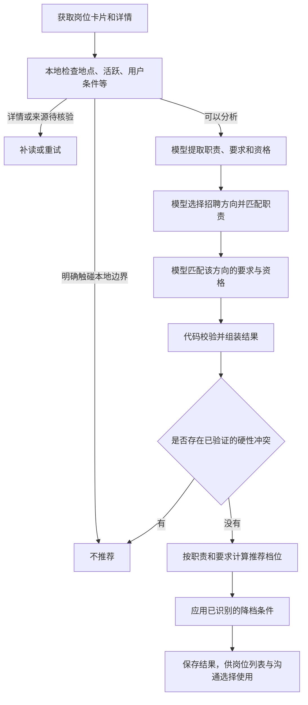
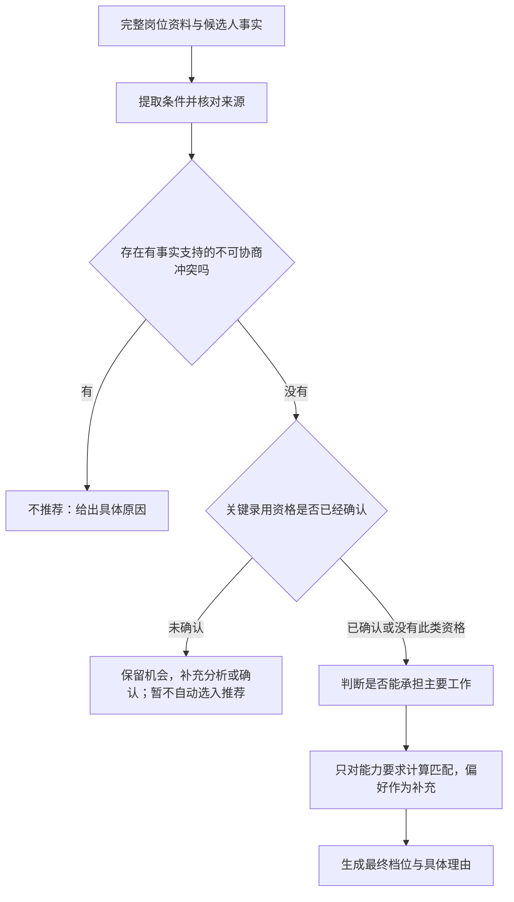

# 岗位筛选模块设计审查

日期：2026-10-10。范围：搜索结果进入筛选、JD 理解、候选人匹配、资格校验、推荐计算、结果保存与后续选用。

本次只审查，没有追加修改产品代码。此前毕业日期范围等修复仍在工作区，不能把那些局部修复当作本次整体整改已经完成。

## 结论

“模型提取证据，代码决定最终推荐”的方向可以保留。缺陷在于：不同类型的判断没有形成一份完整、统一的结果，资格判断在传递中丢失，且资格和能力混用了评分分组。补更多日期或关键词规则只能挡住个别案例，不能解决整条链路。

这不是完全没有“不符合”参数。当前已有资格状态 `satisfied/conflict/unknown`，即满足、冲突、未知；缺少的是让这些状态经过校验后，完整地进入最终决定的统一设计。

## 检查依据与边界

- 当前提交：`5d65e6a522d500098bd5fa60e2767129c28bb308`，加工作区已有的局部修复。
- 真实依据：本轮新采集岗位的模型缓存与最终分析，尤其是原来的毕业时间限制案例，以及储能后端架构、工业软件开发案例。
- 复现方法：调用现有生产校验、分析组装和推荐函数，重放原结果；另用虚拟资格条件检查字段传递。没有访问招聘平台，没有发送消息，也没有更改用户数据库。
- 私有证据：D 盘本轮隔离验收目录的 `matching-design-audit-2026-10-10.json`。真实简历、完整 JD 和数据库不放进仓库。
- 本次不是全量效果统计。模拟能证明代码允许某种错误，不能证明所有真实岗位都已经出现该错误。

## 当前实际流程

实现中，已验证的硬性冲突会先于评分处理；但是未被验证器认出的冲突，以及资格未知，没有完整进入这条优先路径。

## 已确认的问题

### 1. 正确的冲突判断可能被校验器抹掉

真实岗位要求在 2026 年 11 月至 2027 年 10 月毕业，候选人明确在 2024 年毕业。原 `matchJob` 缓存的资格行是 `conflict`，即模型已经指出冲突。

但 `model_contract.js` 的资格冲突校验，只能验证部分文字形式。它没有验证出该日期窗口的冲突，将其转换为未知，因而没有生成硬性阻断。独立的学历冲突对照可以正常阻断；虚拟“必须持有 C1 驾驶证、候选人明确尚未取得”的冲突也会被降为未知。

影响：模型判断正确，也可能出现漏筛。新增一种表达方式，就可能再次遇到同类问题。

依据：`src/core/model_contract.js:246`、`:689`、`:698`。

### 2. 资格结果没有完整传到最终推荐

`compactAnalysis` 保存了资格要求的文字，却没有保存每项资格经过校验后的状态。最终决策主要使用职责、任职要求和已生成的硬性阻断。

复现中，一项明确资格没有得到回答，中间结果是 `review`（需要确认），但完整分析经最终评分后变成 `primary`（优先推荐）。原毕业限制结果也能重放出这个覆盖行为。

此外，稀疏输出校验返回原资格数组，而内部判定使用另一份归一化数组：结果对象可以同时保留 `conflict`、没有阻断、又建议待确认。查看保存结果时容易误解实际采用了什么判断。

影响：不仅是明确冲突，关键录用资格尚未确认时也可能成为优先推荐。下游岗位池会使用最终档位，丢失状态会继续影响默认选择。

依据：`src/core/job_analysis.js:413`、`:443`、`:610`；`src/core/model_contract.js:689`、`:767`；`src/storage/job_store.js:747`。

### 3. 资格门槛被当成能力匹配分

分组规则将 `foundation`、`central` 或 `indispensable` 任意为真的要求放进核心组。学历等录用资格也因此可以进入核心能力评分。

真实储能后端架构案例里，核心组只有“本科及以上学历”，该项满足，于是核心分是满分；三项主要架构职责却是缺失。最终其他保护将其留在慎投，没有进入优先推荐，但核心分表达的意义已经不准确。

影响：学历合格可能撑高能力评价；模型如何给要求打标签，也会明显影响结果。满足入场条件，不等于能承担主要工作。

依据：`src/core/four_tier_decision.js:40`、`:49`；真实样本 57。

### 4. 对未知条件的处理不区分重要性

未知要求不进入匹配分的分母；代码另算信息覆盖率，这是合理的分离思路。但当前主要检查总体覆盖率，以及核心组是否全部未知，没有独立检查每个不可协商条件是否已经明确。

原毕业案例中，两个核心项，一个学历满足，一个毕业条件未知；核心匹配分仍是满分。再加其他已知项，可以通过总体覆盖检查。

影响：很多普通项已明确时，会掩盖一个关键资格尚未明确的问题。不能用“整体知道得比较多”替代“这项录用前提已经满足”。

依据：`src/core/four_tier_decision.js:35`、`:388`、`:396`。

### 5. 证据校验主要检查格式，没有可靠核对事实来源

当前主要检查证据有内容、带“JD：”或“简历：”前缀、长度合规。匹配校验上下文没有候选人事实的完整核对路径。

模拟中，即使给校验函数同时提供“本科学历”的候选人事实，它仍会接受模型返回的“已经取得硕士学位”，并将学历资格认定为满足。这个试验没有证明本轮真实模型编造了学历，而是证明目前的校验层不能拦住这种错误。

影响：模型夸大经历、错读学历或混淆年限时，格式正确的证据可能进入正式推荐。仅增加提示词不能保证修复。

依据：`src/core/model_contract.js:549`、`:1083`；`src/core/job_analysis.js:322`。

## 需要进一步定标的问题

### 慎投是否过宽

真实工业软件案例中，C#、上位机等四项核心要求被标为缺失，主要职责也大多缺失；仅数据库相关能力可迁移，最终仍是慎投。

这符合当前矩阵和降档上限，不属于结果传递故障。但“几乎不能承担主要工作”的岗位是否仍值得呈现为慎投，需要用更多职业样本明确标准。不能直接把“缺一项技能”都改成不推荐，否则会误删可学习、可迁移的机会。

### 多招聘方向的资格作用范围

技能要求有 `trackIds`，资格主要是全局文字数组。某资格仅适用于其中一个招聘方向时，其作用范围依赖文字和模型理解，没有同样清楚的结构字段。代码结构中存在这个风险，但本轮没有拿到证明真实误筛的对应样本，应先加有作用范围的模拟对照。

## 建议的整体调整

保留现有模块和模型分工，收口内部数据与最终决策；不更换技术栈，不另建一套筛选模式。

### 一份贯穿全程的条件结果

每个条件都保留：它来自哪里、属于哪个招聘方向、属于资格还是能力或偏好、是否必须满足、有哪些可替代条件、候选人依据、匹配状态，以及状态为何被修改。

同一项资格不要在资格数组和能力数组里各自判定。下游使用校验后的统一结果，原模型结果另外留作诊断，不能混成同一个字段。

### 按顺序作一次最终决定

“学历合格”只决定通过资格门槛，不能给主要工作能力加分。普通技能未写进简历，不等于不会；可迁移能力继续保留，不能统一当成硬性冲突。

### 校验与修复有明确职责

- 日期、学历等可明确比较的条件，使用统一的结构化比较，复用现有规则。
- 语义条件由模型提供有来源的判断；代码不能因为自己不认识一种表达，就悄悄将冲突抹成未知。
- 有来源矛盾或关键结论不清楚时，只补查该条件，保留已经有效的其他分析，不重跑整条找岗流程。
- 证据尽量引用已有候选人事实或原文位置。允许自然的语义概括，不能强制逐字相同，但数值、日期、学历等确定事实必须核对。
- 关键条件未知与网络、模型失败分开：前者是信息问题，后者是执行问题，不能统一无尽重试。
- 推荐由一个入口最终生成，其他阶段只产出事实和判断，不再先生成一套建议又被后续覆盖。

## 验收标准

测试必须走到最终保存结果和岗位池选择，不能只验证中间校验函数。

至少包括：明确资格冲突、资格未知、合格对照、优先条件、明确放宽条件、多学历、多招聘方向、任一替代条件成立、不同语义的证书条件、普通技能缺写、核心工作明显不匹配、可迁移经历、输入事实与模型证据矛盾。

关键约束：

1. 普通匹配分再高，也不能抵消有证据的不可协商冲突。
2. 关键录用资格未知时，不得自动进入优先推荐或可投选择；机会保留，不强制排除。
3. 学历等入场资格不能增加能力匹配分。
4. 增加普通匹配项，不能改变一项资格冲突是否生效。
5. 校验、保存、展示、默认选择必须使用同一份最终判断。
6. 改变模型管线或规则后，旧分析正确失效；不能将旧推荐直接当成新规则的验收结果。

先验证这些数据与决策约束，再用冻结的新岗位样本比较误推荐与漏推荐。匹配宽松程度的调整单独定标，不借结构整改顺便提高淘汰门槛。

## 本次未做

没有实施上述整体调整，没有重算全部岗位，没有发布新版本，也没有把本轮验收标为完成。此前日期窗口局部修复已能排除该真实案例，但模型通道和其他资格类型的结构缺口仍需整体处理。
