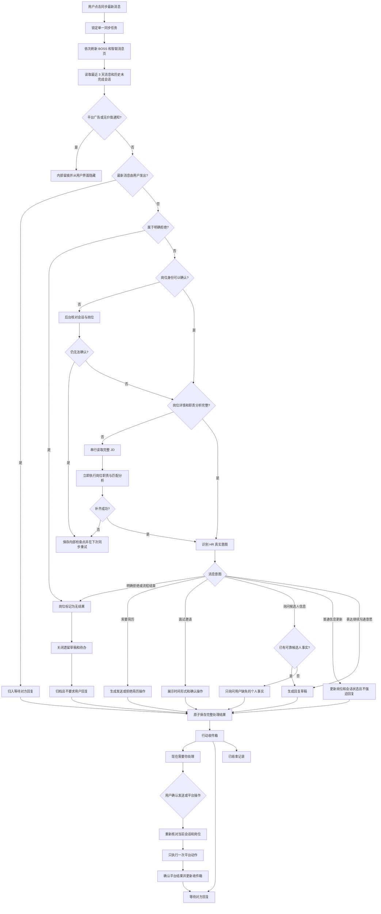

# OfferGo 消息发现完整路由设计

## 目标

消息发现只向用户展示已经完成必要理解、并且确实需要用户关注的招聘消息。平台推广、明确拒绝和系统内部补资料任务不进入用户待办。岗位资料不足时，OfferGo 自己读取详情、完成职责与匹配分析并从检查点重试，不把产品内部缺口交给用户。

本设计只调整消息发现链路，不改变岗位扫描、沟通发送授权、BOSS/智联安全节奏、现有 HTTP 地址或数据库表结构。

## 已确认的真实问题

- 本地消息时间线中存在 9 条 BOSS 竞争者会员推广卡。读取器已经把它们识别为 `platform_notice`，但页面无差别渲染所有时间线事件，因此推广仍会出现在完整会话中。
- 两个 BOSS 会话的最新消息是明确拒绝“抱歉/不好意思，不太合适”，却仍处于 `needs_action` 和 `reply_ready`，并保留了 3 份开放草稿。
- 当前候选人关联岗位中有 8 个 BOSS 岗位和 19 个智联岗位的 `semanticStatus` 为 `pending`。消息详情读取后写入的岗位会被标成 `message-discovery-detail + pending`，但 `hasCompleteJobContext` 仍把它视为完整上下文。
- 新收到的招聘方消息在完成岗位补齐和意图识别前，会先被投影成 `needs_action`，因此处理中间态可能短暂或长期暴露给用户。

## 选择的方案

采用“确定性高置信规则 + 模型理解复杂表达 + 内部检查点重试”。

- BOSS 竞争者会员推广由 DOM 结构和稳定文本双重识别，保留内部审计记录，但从消息列表、完整会话和行动计数中隐藏。
- 明确拒绝先由高精度本地规则处理；委婉拒绝由模型使用新增的 `rejection` 意图处理。
- 新读取的岗位详情必须立即运行现有岗位分析能力，只有职责信息和语义分析都完整后才能用于消息分类和展示。
- 资料读取或分析暂时失败时，继续使用现有 unresolved/checkpoint 数据重试，不新增队列、服务或数据库表。
- 只在登录失效、平台安全验证、标签页丢失等确实需要用户介入时显示阻断提示。

不采用以下方案：

- 全部交给模型：增加延迟、成本和明显拒绝误判风险。
- 只在页面隐藏：不会修复错误岗位状态、开放草稿和后续漏斗数据。

## 消息发现流程

## 组件边界与数据流

### 1. 平台噪音过滤

`boss_message_dom` 继续负责识别 BOSS 消息卡类型。竞争者推广卡返回 `platform_notice`，并附加稳定的 `noticeKind: competition_promotion` 元数据。页面渲染时间线时排除该类型；对于旧数据，使用收窄到“竞争者 PK + 查看详细分析”的文本兼容判断，从而立即隐藏历史推广。

其他有价值的平台状态通知继续保留，不能为了屏蔽推广而删除所有 `platform_notice`。

### 2. 明确拒绝处理

消息组在岗位详情读取之前先执行高精度终局判断。只有招聘方方向的文本，并且包含明确的不匹配或结束表达时，才进入拒绝分支。规则覆盖“抱歉/不好意思，不太合适”“岗位不匹配”“暂不考虑”等直接表达，不使用单独一个“不”字或模糊语气作为依据。

模型协议增加 `rejection` 意图，用于本地规则没有覆盖但语义明确的委婉拒绝。`rejection` 必须满足：

- 不允许生成草稿。
- 进度卡转为 `rejected`。
- 收件箱转为 `done`，操作码为空。
- 关闭同一卡片下尚未完成的回复草稿。
- 保留时间线和拒绝事件，供历史查看和漏斗统计。

如果岗位卡无法可靠关联，仍可将该会话收件箱归档为 `done`，但不能猜测并修改其他岗位卡。

### 3. 岗位资料自动补齐

消息分类只接受以下岗位上下文：

- 完整 JD 达到平台对应的最低有效长度。
- 岗位语义分析 `semanticStatus === complete`。
- 岗位、会话、候选人和当前搜索方案身份一致。

`message-discovery-detail + pending` 不再视为完整。新读取详情写入本地后，消息发现调用现有单岗位分析用例，使用批量筛选模型和当前候选人/匹配卡完成职责、要求、匹配与风险分析，再重新读取并校验上下文。

分析失败、详情暂时不可读或岗位身份仍无法确认时：

- 保存 unresolved 检查点和已取得的消息内容。
- 不创建草稿，不把该会话放入用户可见的“需要处理”或“系统补资料”分组。
- 下次同步继续补齐，不重复创建岗位、卡片或外部读取动作。
- 只有登录、安全验证、页面丢失等用户能够解决的问题才显示提示。

已经下架且从未取得完整 JD 的岗位保留内部历史与消息原文，但不会伪造岗位职责或展示半成品决策卡。明确拒绝、简历请求和面试邀请等不依赖岗位判断的终局/结构化动作，仍可按已验证的会话身份处理。

### 4. 收件箱发布时机

扫描阶段不再把所有招聘方新预览直接写成 `needs_action`。用户可见状态只在消息完成噪音过滤、终局识别、岗位补齐和意图分类后一次性写入。

- 用户最后发送：`waiting`。
- 明确拒绝：`done`。
- 有完整上下文且需要回复或操作：`needs_action`。
- 普通信息更新且无需动作：根据会话方向进入 `waiting` 或 `done`。
- 内部补齐失败：只保存在 unresolved 检查点，不发布到收件箱。

同一次提交同时更新进度卡、分类事件、草稿、消息上下文、检查点和收件箱状态，失败时整体回滚。

## 历史数据修复

下一次消息同步开始时先执行一次幂等的本地协调：

1. 给历史竞争者推广事件补充可识别语义，并确保渲染层隐藏。
2. 扫描尚未完成的招聘方文本；明确拒绝会话转为 `done`，关联岗位转为 `rejected`，关闭遗留开放草稿。
3. 对与消息会话关联且分析为 `pending` 的岗位进入现有分析流程；完成前不发布半成品卡片。
4. 重复运行不产生新草稿、重复事件或重复状态转换。

该协调只修改本地数据，不向 BOSS 或智联发送任何消息、简历或操作。

## 页面结果

行动收件箱保留三种用户可理解的结果：

- 现在需要你处理：已有完整岗位理解，且确实需要用户决定或回复。
- 等待对方回复：用户已经回复或完成平台操作。
- 已结束记录：招聘方明确拒绝、岗位关闭或用户已完成处理。

“系统正在补充资料”不再作为用户消息分组。同步状态只显示整体进度；内部补齐任务通过日志和检查点诊断，不把责任交给用户。

## 测试与验收

### 自动回归

- BOSS 竞争者推广卡被识别为 `competition_promotion`，不进入消息列表、完整会话和行动计数；普通平台通知仍正常显示。
- 历史推广事件即使没有新元数据，也会被兼容过滤。
- 明确拒绝不会调用岗位详情读取或草稿模型，岗位转为 `rejected`，收件箱转为 `done`，旧草稿关闭。
- 模型返回 `rejection` 时合同强制草稿为空并使用终局状态。
- 模糊文本不会被本地规则误判为拒绝。
- `semanticStatus: pending/failed/stale` 的岗位不能用于消息决策卡或草稿。
- 新读取 JD 会执行一次岗位分析；分析成功后继续消息分类，失败时只保留内部检查点。
- 多次同步不会重复分析已完成岗位、重复关闭草稿或重复写入拒绝事件。
- Dashboard 不再渲染“系统正在补充资料”分组。

### 真实 Edge 验收

- 使用当前登录的六个固定标签，BOSS 和智联串行同步。
- 同步前后确认没有额外窗口、并发读取或残留临时标签。
- BOSS 竞争者推广不再出现在会话详情。
- 两条现有明确拒绝从“需要处理”移到已结束，且没有回复草稿。
- 抽查原先分析为 pending 的关联岗位：只有完成 JD 和职责分析的消息才进入行动收件箱。
- 不执行任何真实回复、简历发送、申请或其他外部写入。

## 兼容与边界

- 不新增运行依赖、微服务、ORM、消息队列或数据库表。
- 不改变 Dashboard 地址、CLI、Agent stdio、数据目录和 SQLite schema。
- 保留 BOSS/智联串行读取、随机间隔、访问额度、检查点和风控即停规则。
- 不扩大消息发送授权；读取和整理消息不代表允许发送。
- 图片、语音和附件仍按当前约定暂不处理。
