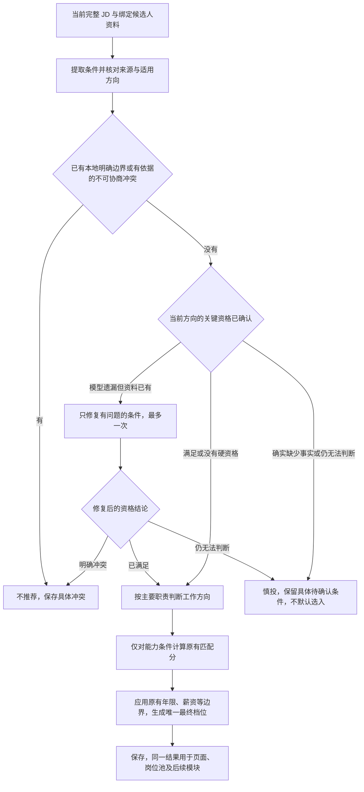

# 岗位筛选统一证据与决策设计

## 当前执行方向：模型主导岗位判断（2026-10-10 用户纠正）

最新执行状态：用户要求先详细分析方案与实际效果，不能直接执行本节的实现设想。分析见[当前核对与方案比较](../../reports/2026-10-10-matching-design-review.md#当前核对先分析效果再决定改动范围2026-10-10)。本节保留目标与职责原则；“保留拆分、最后一段作整体判断”仅为候选A，须与复用联合匹配的候选B在隔离材料上比较，再确定最终设计。当前不改产品代码、不切换验收环境。

用户明确：岗位筛选本质是模型阅读JD与简历、理解、判断并给结果；不能以穷举“必须/刚需/只限”等字词或本地评分取代模型思考。本节取代下文原有“模型建议只作shadow、70/30矩阵决定最终档位”的选择。之前的规则扩展和检查仅是历史实验，不是此方向的完成证据。

职责改为：模型负责理解条件的真实含义、硬性或优先、否定和替代关系，并结合当前简历给出资格、职责、能力、投递建议和具体理由。项目负责正确传递这些结构化判断，校验字段/来源/岗位与候选人身份、检查结果内部是否矛盾、保存结果、显示结果并在中断后恢复。项目不再根据JD措辞推导另一套语义条件，也不以本地评分覆盖模型建议。用户显式设置的地点等筛选项、平台访问节奏和外部动作授权仍保留。

候选A沿用现有岗位理解→职责/要求匹配链路，让现有要求调用接收已核验的职责结果并返回完整建议；候选B复用联合匹配，同时判断职责、要求与整体建议。两者均不新建规则引擎或独立筛选模式，不新增常态模型请求。首先核对每段模型原输出及校验前后变化，再以效果决定调用结构。自然语言的同义表达由模型识别；结构字段和值集合是数据接口，不是同义词穷举。模型漏字段、结果矛盾或丢失来源属于分析失败，复用有界定向修复；不能伪装为用户资料未知，更不能丢掉已识别的资格冲突。

验证必须分开两层：代码测试证明模型的满足/冲突/未知、优先/硬性、AND/OR和最终档位原样到达保存与页面，不被本地重判覆盖；实际模型效果用未参与提示修改的不同措辞、职业背景和复杂JD证明模型真正理解。对新旧推荐差异逐份核对，不能把仅有流程通过或正则命中当成理解能力。原70/30分数仅保留为兼容诊断和对照，不作为新流程结论来源。旧数据保留，旧结论不能未经新流程重评就冒充新方案效果。

本节是当前整改设计；模型主导链路尚未实施和验收。当前发布仍为v1.4.1，本轮不发布，原四步验收与不确定发送记录保持。

日期：2026-10-10。状态：设计提案，未实施。关联：[整体审查](../../reports/2026-10-10-matching-design-review.md)、[原任务检查点](../reports/2026-10-10-four-step-acceptance-checkpoint.md)、[实施计划](../plans/2026-10-10-matching-decision-convergence.md)。

## 以下为此前规则主导设计，保留作历史对照

以下“让模型直接决定最终档位不采用”与“三个纯规则模块”等选择已被当前目标取代，不再执行。保留原始问题来源，不将历史实施和实验冒充模型主导设计已完成。

## 要解决的实际问题

模型已经判断资格冲突，但项目校验将其变成未知；资格状态未完整传递；学历等资格进入能力评分；重要未知项被总体覆盖率掩盖；证据格式正确却不一定来自真实候选人事实。

目标不是让筛选更严，而是让项目正确使用已有判断，能解释为什么推荐，同时保留可迁移、可学习的机会。成功与否要看最终岗位和用户获得的建议，不能只看模型 JSON 合法。

## 方案选择

| 方案 | 结果与代价 | 选择 |
|---|---|---|
| 继续增加日期、驾照等文字规则 | 能修个例，但资格传递、混分及事实来源问题仍在，新表达还会漏 | 不作为整体方案；已有明确比较逻辑继续复用 |
| 让模型直接决定最终档位 | 少一些本地规则，但难以保证冲突不被技能优势抵消，结果不稳定且难诊断 | 不采用 |
| 保留模型提取与匹配，统一条件结果和最终决策 | 对当前结构作有限调整；条件、证据、评分职责清楚，能逐阶段验证 | 采用 |

保留原 Node 22、CommonJS、模块化单体、SQLite、Dashboard、CLI 和模型适配器。新增至多三个纯规则模块，不引入规则引擎、依赖注入、ORM、新运行依赖或第二套扫描模式。

## 面向用户的效果标准

| 场景 | 什么才算正确 |
|---|---|
| 明确不可协商条件，候选人有相反事实 | 不推荐，具体说出冲突；其他技能再多也不能抵消 |
| 资格满足、能力匹配 | 能进入正常推荐，不能因为新增校验普遍卡在待确认 |
| JD 写优先、加分、接受替代 | 按真实语义保留机会，不能改成硬性淘汰 |
| 未写某技能、某经历 | 不把“简历没写”当成“明确不会”；可迁移经历仍有效 |
| 关键资格确实未知 | 保留为慎投并说明具体缺什么，不自动选入；不阻塞其他岗位 |
| 输入已有事实，模型漏答或错读 | 项目补判或只修复该项，不让用户重新提供已有信息 |
| 原事实没有答案 | 不编造；只有这类真实信息缺口才需要用户补充，不能把模型漏答伪装成用户缺资料 |
| 满足本科学历但不能承担主要工作 | 资格通过，不给能力加分；职责判断如实反映缺口 |
| 相邻岗位有可迁移经历 | 保留为可投或慎投的可能，不为清理误推荐而统一拒绝 |
| 多招聘方向 | 只应用所属方向和全局条件；一个方向不合格不能直接否定其他有效方向 |
| 同一事实与 JD 换一种表达 | 日期、学历等确定比较结果不变；语义项可以有合理差异，但不能绕过同一资格门槛 |
| 暂停、重启、单条分析失败 | 已有正确结果保留，其他岗位继续；恢复不产生重复岗位或外部动作 |

## 数据职责

内部明确分开三类条件：

1. **资格**：毕业窗口、在校身份、学历、证照等录用前提。决定是否可以进入推荐，不参与能力分。
2. **能力**：主要工作、必要基础能力、普通支持能力。继续复用职责匹配和 70/30 能力评分。
3. **偏好**：优先、加分、可接受的背景；用户地点、薪资等选择仍复用现有本地边界，不让模型自行改成硬条件。

能力中的不可协商前提仍可以阻断，但必须有 JD 明确边界和候选人明确不兼容事实。“精通”“熟练”或普通职责陈述不能单独变成淘汰依据。年限不足继续走当前宽松策略，不借本次整改改成资格拒绝。

### 统一条件与证据

模型的自然描述可以保留，但正式判断必须关联已有证据。内部契约如下，字段名在后续任务中保持一致：

```js
// JobCondition，ID 由归一化层分配，模型不能创造未提供的 ID。
{
  id: 'E1',
  category: 'qualification', // qualification | capability | preference
  label: '毕业日期范围',
  trackIds: ['T1'],          // 必须为既有招聘方向；全局条件列出全部方向
  strength: 'mandatory',     // mandatory | preferred
  jdEvidenceRefs: ['J1'],
  alternatives: [            // 任一分支全部成立即可，不使用通用表达式解释器
    { allOf: [
      { kind: 'graduation_date', operator: 'within', value: ['2026-11-01', '2027-10-31'] }
    ] }
  ]
}

// ConditionResult。资格与能力共享来源和诊断字段，状态含义保持分开。
{
  conditionId: 'E1',
  category: 'qualification',
  state: 'conflict',         // 资格：satisfied | conflict | unknown
                            // 能力/偏好：matched | transferable | missing | unknown
  candidateEvidenceRefs: ['C1'],
  jdEvidenceRefs: ['J1'],
  reasonCode: 'confirmed_date_conflict',
  basis: 'local_comparison', // local_comparison | grounded_model
  reportedState: 'conflict',
  adjustmentReason: ''       // 不修改时为空；修改状态必须解释原因
}

// EvidenceEntry。不新增数据库表，来自当前绑定的候选人资料和当前 JD。
{
  id: 'C1',
  sourceKind: 'resume',      // resume | profile_fact | jd
  sourcePath: 'education[0].endDate',
  sourceHash: 'sha256-of-bound-source',
  quote: '2024年毕业',
  value: '2024',
  precision: 'year'          // 确定事实记录粒度；无确定值时不编造
}
```

`alternatives` 只表达 JD 中真实存在的替代条件。比如资格明确接受两种证照之一，任一已满足则通过；全部明确不符才冲突；一项未知且其他不符，则整体未知。混合条件允许分支内 `allOf`，不实现任意嵌套脚本、正则或外部表达式执行。

毕业条件如明确限定本科阶段，日期原子额外保留 `educationLevels: ['本科']`；未限定时不擅自补此字段。学历与毕业日期关联同一条教育记录，不能把本科的学位与另一段学历的毕业日期拼接成满足。在读新学历未知只有在它属于 JD 接受的学历范围时才影响结论，不能冲淡明确的“本科毕业日期”冲突。

`kind` 首批支持 `graduation_date/education_level/student_status/credential/semantic`。既有能力字段 `foundation/central/indispensable` 保留在能力条件的匹配投影中；不将这些标志重新用来判断资格的种类。`semantic` 必须保留原文、作用范围和明确的候选人依据，不能因本地不认识关键词就抹掉结果。

资格与 requirements 中重复出现的同一 JD 前提归为一项条件，保留两个来源引用；不能对同一个限制比较两次或加两次分。只有来源和逻辑范围都能确认一致时合并，不凭标签相似合并不同条件。

### 事实核对的程度

- 优先使用匹配卡绑定的原简历、已确认画像和现有资料接口，不重建用户档案，不引入第二套长期记忆。
- JD 引用和候选人引用必须能找到当前来源。模型可自然概括经历，但正式学历、日期、证照、明确“从未做过”等结论须引用具体事实。
- 数值、日期、学历、证照身份按事实比较；8 个月不能写成已满足一年，但这不意味着年限不足就硬性拒绝。
- 日期只写年份时保留不确定区间，不能补成某个月；继续复用已写好的毕业区间规则。
- 正向“满足”与反向“冲突”都核对来源，不能只严格核对拒绝而放过虚构满足。
- 引用不必与自然总结逐字相同；无需引用的文风、措辞不参与事实校验。模型原结果与校验结果分开，日志仅记录 ID、状态、原因、版本和计数，完整私有内容留在隔离数据中。
- 旧画像原文缺失时，先复用现有绑定原文恢复路径；确实无法恢复时保留可追溯的结构事实并注明来源，不能把旧用户全部判成资料不合格，也不能凭空生成原文出处。
- 求职所需的正常事实照常参与判断，不以“保护隐私”为由屏蔽已提供的学历、经历或工作状态。

## 单一最终决策



技术失败独立处理：网络、模型调用、非法结果修复失败仍为 `decisionStatus=needs_retry`，推荐为空，不能伪装成“资格未知”。不符合与资料不足也分开，不能把未知统一改成不推荐。

正式结果增加内部 `conditionSchemaVersion: 1`、`conditions`、`conditionResults`、`qualificationStatus`、`decisionReasons`。资格汇总值为 `satisfied/conflict/unknown/not_required`。这些通过现有 `analysis_json` 保存；SQLite schema、表结构和用户数据不变。

外部四档名称、Dashboard 路由、CLI 参数及退出行为、`offergo.agent.stdio` v1 外层协议不变。Agent 仍通过当前协议接收任务和指令，不引入嵌套 Agent。内部模型任务输入可以增加来源引用和条件字段，兼容入口须明确验证。

`applyRuleGuard` 保留为兼容入口，转调唯一最终决策；`deriveMatrixDecision` 只计算能力矩阵。模型契约校验负责形状、引用和状态一致性，不再成为另一个正式推荐来源。历史兼容的中间推荐字段可以暂时保留，但不能参与新最终档位。

## 关键未知与修复

区分三个原因：

| 原因 | 自动行为 | 最终呈现 |
|---|---|---|
| 资料已有，但模型遗漏或输出与事实矛盾 | 确定比较直接纠正；语义项复用 `matchRequirements` 的一次有界修复，只给出需要修复的条件 ID 并冻结其他有效结果 | 修复后按事实决定；仍不清楚时保留慎投及具体原因 |
| 原资料确实没有该事实 | 不重复调模型猜测，不重建画像，不阻塞整轮 | “岗位要求……，目前资料未注明……”；只在用户选择这份机会时关注该问题 |
| 调用或结果损坏 | 复用现有任务重试、错误分类和检查点 | 分析待恢复；与资格待确认分开 |

每份岗位的同一次分析最多一次语义条件修复；不对每条条件各自创建循环。现有 JSON/字段结构的单次修复边界保留，不能与同一次语义修复叠加成重复循环；分别记录结构修复与语义修复次数。中断保留已有结果，不将旧推荐误读为新规则结果。

## 多招聘方向

条件必须有明确 `trackIds`，全局资格与分支资格分开。可直接比较的条件先算每个方向的资格状态，再将可选方向传入现有职责选择步骤。

如果模型选择的方向随后因有依据的分支资格冲突被排除，复用现有职责与要求匹配检查剩余方向；同一方向只检查一次，最多为已有方向数量，沿用当前最多四个方向。全局冲突可直接结束。其他方向尚未检查时，不得把一个分支冲突保存成全岗位不推荐。

普通单方向流程不增加固定模型调用。多方向额外调用只在已确认分支不符且还有真实候选方向时发生，记录次数与耗时；不虚构分支、不并行重复读取平台、不增加浏览器操作。

## 模块与责任

| 文件 | 责任 |
|---|---|
| 新增 `src/core/job_match_evidence.js` | 从当前输入构建证据目录、核对引用与确定事实；纯函数，无 SQL、网络或输出 |
| 新增 `src/core/job_match_conditions.js` | 统一条件与状态、作用范围、替代关系、确定比较与资格汇总；复用 `job_eligibility.js` |
| 新增 `src/core/job_match_decision.js` | 唯一最终决策，资格优先、能力投影、理由与诊断 |
| `src/core/model_contract.js` | 解析新契约并兼容旧入口，调用证据/条件校验，分开 reported 与 normalized |
| `src/adapters/models/structured.js`、`mock.js` | 复用现有模型任务，明确条件种类和来源，模拟器提供对应真实字段；不新增供应商适配器 |
| `src/core/split_semantic_matching.js` | 在现有分阶段流程传递条件及结果；资格范围随方向过滤 |
| `src/core/job_analysis.js`、`four_tier_decision.js` | 组装完整结果、兼容转发、只对能力评分 |
| `src/core/analysis_revision.js` | 修改相应模型管线与规则版本，防止旧缓存被当作新判断 |
| `src/storage/job_store.js`、`src/core/workflow_inventory.js`、`src/core/message_routing_policy.js` | 消费统一结果；不得各自重新解析 JD 或生成第二套分数 |
| `src/application/analysis/` | 复用现有单条重试和批次重评；业务编排不新增直接 SQL |

新模块不得依赖 application、Dashboard、storage 或 adapters。模块职责重叠时优先合并纯函数，不能为三个文件的数量再增加转发层。现有明确比较函数可导出给条件模块，不复制一套日期/学历解析器。

## 迁移与兼容

1. 已有局部修复先完整验证并独立提交，不和本次结构整改混成无法回退的一次提交。
2. 先引入统一结果，再切最终决策，最后收口消费者。每个阶段相关测试通过后提交，阶段提交前运行完整离线浏览器门禁。
3. 明确更新 understanding/matching/decision 对应版本；新字段缺失的旧分析不能直接作为新规则的活动推荐。
4. 旧数据仍可打开、历史记录仍可显示；对有完整缓存 JD 的活动岗位按当前绑定资料重评，不重新采集，不自动发送，不批量重跑画像。
5. 已确认或已经执行的沟通批次保持原不可变快照；不能因新规则变化重写授权、撤销历史动作或重放发送。
6. 技术回退恢复对应代码与版本，保留数据库原数据。不得用删除结果或恢复旧备份覆盖用户新操作实现回退；新结果在旧规则下按版本视为需要重评。

## 必须通过的决定约束

- 明确资格冲突不能被能力、软偏好或低风险信号抵消。
- 关键资格未知不自动进入 `primary/apply`；普通技能未知仍遵循原证据覆盖策略。
- 资格通过不能增加能力分。仅增加一个已满足学历条件，不改变原能力分。
- 增加无关匹配项，不改变资格结论；条件顺序变化和重复引用不改变结果。
- 任一允许的替代条件成立，不能以另一条不成立拒绝。
- 资格和能力的状态及来源在模型校验、保存、读取、展示、默认选择中一致。
- 不编造事实，不要求措辞机械逐字相同；已给出的信息不会因模型漏答而要求用户重填。
- 一条条件修复失败不丢其他结果、一份岗位失败不阻塞整轮、恢复不重复外部操作。
- 旧缓存、新缓存、同一次 fresh 调用的输出遵循同一归一化与决策规则。

## 效果定标与停止条件

先用原 31 份通用 fixture 与新增跨职业情况验证确定约束；再用已冻结首 20 份独立标签及合成背景实际模型输出作受控新旧比较。最初 20 份中存在经验宽松、岗位活跃、地点等政策差异，要逐条裁定，不能全部当成算法错误。冻结 JD 是同一输入的效果实验，不以旧操作库的采集数量或历史推荐验证新规则的实际召回/精度。最终实际找岗质量检查另建新规则下的空操作基线，保留简历、匹配卡、方案、模型设置及账号节奏/预算；原库和待办保留，不以重建新库消除旧 12 份详情的责任。

必须报告：明确冲突误推荐数、可投机会误排数、未知误当不符数、资料已有却反复待确认数、最终档位与默认选择不一致数、额外模型调用和等待变化。列分子/分母和逐岗位理由，不仅报一个平均准确率。

已明确约束类错误目标为零；所有新增测试和原基准必须覆盖对应正反例。20 份只作集中诊断，不能宣称统计意义上的全市场准确率。若非目标类“保留机会”下降，逐条检查；发现意外误排即停止默认切换并修复，不为了使拒绝率好看删除标签。

**本次保持 70/30 权重、二维矩阵与当前年限宽松程度。** 资格脱离能力分造成的预期变化单独解释。慎投是否进一步收紧，先另列候选规则、逐份新旧差异及失去的可迁移机会，再由用户决定；没有决定时不修改该政策，也不阻塞本次结构修复。

最后冻结精确 SHA，执行完整浏览器必跑门禁与同 SHA CI，在隔离 Edge 通过产品页面验证读取、重评、展示及默认选择；验收本模块不发送任何真实沟通。然后回到原四步清单，不能仅凭此模块通过就发布新包。
